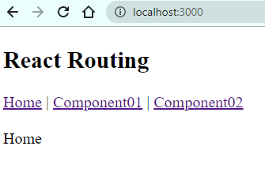

# React

## Contents

- [React](#react)
  - [Contents](#contents)
  - [Overview](#overview)
  - [Single File React HTML Pages](#single-file-react-html-pages)
  - [Standalone Projects](#standalone-projects)
  - [Resources](#resources)
  - [Introduction](#introduction)
  - [Starter Code](#starter-code)
  - [Component (think of as a class)](#component-think-of-as-a-class)
    - [CreateElement From Component (think of instantiating a class)](#createelement-from-component-think-of-instantiating-a-class)
    - [Render Method](#render-method)
    - [Rendering An Element In Raw HTML](#rendering-an-element-in-raw-html)
  - [Elements](#elements)
  - [Render Method](#render-method-1)
  - [React Clock](#react-clock)
  - [Components](#components)
  - [Display Component](#display-component)
  - [Multiple Components](#multiple-components)
  - [Component As A Separate File](#component-as-a-separate-file)
  - [Passing Data To Components](#passing-data-to-components)
  - [Component As A Class](#component-as-a-class)
  - [createElement](#createelement)
  - [React Router](#react-router)
  - [State](#state)
  - [State inside one component](#state-inside-one-component)
    - [Passing state between components](#passing-state-between-components)
    - [Child Component With Own State](#child-component-with-own-state)
    - [Alter Child State From Parent](#alter-child-state-from-parent)
  - [Alter Parent State From Child](#alter-parent-state-from-child)
  - [Buttons](#buttons)
  - [API Javascript Fetch](#api-javascript-fetch)
  - [Resources](#resources-1)
  - [Javascript Fetch](#javascript-fetch)
  - [API Post](#api-post)
  - [API Put](#api-put)
  - [Async Delete](#async-delete)

## Overview

This is a teaching repository for React created by Facebook.

The repo is sorted into [single file react projects](SingleHtmlFiles) which can be run as standalone files ie they have React imported as a CDN into a single HTML file.  

This repository is a combination of my own learning, also learning React from Udemy's web developer course of 2018, and also from Egghead which has a course on React.

Also I have a much more complex set of standalone projects built with the `create-react-app` [here](StandaloneProjects).

## Single File React HTML Pages

[Single File React HTML Pages](SingleHtmlFiles/README.md)

## Standalone Projects

[React Projects Built With `create-react-app`](StandaloneProjects/README.md)

## Resources

[reactforbeginners.com](https://reactforbeginners.com/)

[React Learning Path](https://medium.com/free-code-camp/learning-react-roadmap-from-scratch-to-advanced-bff7735531b6)

[Build This Game On React Docs Tutorial](https://reactjs.org/tutorial/tutorial.html)

[FreeCodeCamp React Tutorial](https://www.freecodecamp.org/news/all-the-fundamental-react-js-concepts-jammed-into-this-single-medium-article-c83f9b53eac2/)

Free React Course https://scrimba.com/learn/learnreact

[Live Play Around With React And Learn Basics - All In Browser](https://jscomplete.com/playground)

Examples - https://www.jqwidgets.com

[Facebook React Tutorial] https://facebook.github.io/react/tutorial/tutorial.html


## Introduction

Statement by creators of React at Facebook 

*React is, in our opinion, the premier way to build big, fast Web apps with JavaScript. It has scaled very well for us at Facebook and Instagram.*

React updates the view (render) when underlying data changes

A view exists for every 'state' of the app

'Declarative' views

'Encapsulated components' which manage their own state

Render using

	Javascript

	JSX which uses XML to store data

React Setup

https://reactjs.org/tutorial/tutorial.html

```js
choco install yarn
yarn global add create-react-app

// or
npm install -g create-react-app
create-react-app my-app
cd my-app
npm start
```

## Starter Code

Strip back all of the React boilerplate code and just get your bare minimum

```jsx
create-react-app myapp; cd myapp;yarn start
// remove all extra css and tests and leave 
// index.html
<!DOCTYPE html>
<html lang="en">
  <head>
    <meta charset="utf-8" />
    <link rel="icon" href="%PUBLIC_URL%/favicon.ico" />
    <meta name="viewport" content="width=device-width, initial-scale=1" />
    <meta name="theme-color" content="#000000" />
    <meta
      name="description"
      content="Web site created using create-react-app"
    />
    <link rel="apple-touch-icon" href="%PUBLIC_URL%/logo192.png" />
    <link rel="manifest" href="%PUBLIC_URL%/manifest.json" />
    <title>React App</title>
  </head>
  <body>
    <noscript>You need to enable JavaScript to run this app.</noscript>
    <div id="root"></div>
  </body>
</html>
// App.js
function App() {
  return (
    <div>
    </div>
  );
}
export default App;
// index.js
import React from 'react';
import ReactDOM from 'react-dom';
import App from './App';
ReactDOM.render(
  <React.StrictMode>
    <App />
  </React.StrictMode>,
  document.getElementById('root')
);
```
## Component (think of as a class)

Component
Input
Props
Output
Returns a HIERARCHY OF VIEWS to display via RENDER method

```js
// Sample Component code
class ShoppingList extends React.Component {
  render() {
    return (
      Shopping List for {this.props.name}
    );
  }
}
```

### CreateElement From Component (think of instantiating a class)

```js
return React.createElement('div', 
	{className: 'shopping-list'},
  	React.createElement('h1', ...),
  	React.createElement('ul', ...)
);
```

### Render Method

Returns a description of what you want to render
Returns a REACT ELEMENT which is a lightweight description of what to render
Create REACT ELEMENT using JSX language
Any Javascript expression can go inside the JSX expression
Every REACT ELEMENT is a REAL JAVASCRIPT OBJECT
React uses these instructions to render the screen


### Rendering An Element In Raw HTML

Before we talk about React let's talk about how raw HTML renders an element which goes something like this

```js
<div id="root"></div>
<script type="text/javascript">
  const rootElement = document.getElementById('root')
  const element = document.createElement('div')
  element.textContent='Hello World'
  element.className='container'
  rootElement.appendChild(element)
</script>
```


## Elements

An element can be

```jsx
const element = <div />;
```

or be user-defined with `props` passed to it

```jsx
const element = <Welcome name="Phil" />;
```


## Render Method

Returns a description of what you want to render

Returns a REACT ELEMENT which is a lightweight description of what to render

Create REACT ELEMENT using JSX language

```js
return React.createElement('div', 
  {className: 'shopping-list'},
  React.createElement('h1', ...),
  React.createElement('ul', ...)
);
```

Any Javascript expression can go inside the JSX expression

Every REACT ELEMENT is a REAL JAVASCRIPT OBJECT

React uses these instructions to render the screen


## React Clock

Here is a basic clock

```js
function tick() {
  const element = (
    <div>
      <h1>Hello, world!</h1>
      <h2>It is {new Date().toLocaleTimeString()}.</h2>
    </div>
  );
  ReactDOM.render(element, document.getElementById('root'));
}

setInterval(tick, 1000);
```

The setInterval function calls function tick() every second.

This function tick() calls ReactDOM.render() so this gets called every second.

It renders the chosen element, in this case `hello world` plus a time string, to the screen at the position of the `div` element with id `root`.

React will compare the previous and current rendition of the screens in the virtual DOMs which it creates. It will then only render the changes, making for a more efficient screen re-render.

We can see this visually by `inspecting` the clock with Chrome Dev Tools and expanding to see the relevant HTML element. We can see the rest of the DOM is static but this little bit updates on every clock tick.


## Components

Components are HTML/CSS/Javascript code segments.

`props` can be passed in

`render` generates the output

	


A component can be defined most simply as a function

```jsx
function DisplayThis(props){
  return <h1>Display This {props.name}</h1>;
}
```

which is the same as

```jsx
class DisplayThis extends React.Component {
  render() {
    return <h1>Display This {this.props.name}</h1>
  }
}
const element = <DisplayThis name="Phil" />;
ReactDOM.render(
  element, document.getElementById('root')
);
```

## Display Component

We display a component thus

```jsx
create-react-app component-01
cd component-01
```

index.js is thus, and delete all other files!

```js
import React from 'react';
import ReactDOM from 'react-dom';
class DisplayThis extends React.Component {
  render() {
    return <h1>Display This {this.props.name}</h1>
  }
} 
const element = <DisplayThis name="Phil" />;
ReactDOM.render(
  element, document.getElementById('root')
);
```

## Multiple Components

```jsx
import React from 'react';
import ReactDOM from 'react-dom';

class Component01 extends React.Component {
  render() {
    return <h1>This is a component displaying here {this.props.name}</h1>
  }
} 

class Component02 extends React.Component {
  render() {
    return <h1>This is a component displaying here {this.props.name}</h1>
  }
}

class Component03 extends React.Component {
  render() {
    return <h1>This is a component displaying here {this.props.name}</h1>
  }
}

const element = 
  <>
    <Component01 name="Component01" />
    <Component02 name="Component02" />
    <Component03 name="Component03" />
  </>;

ReactDOM.render(
  element, document.getElementById('root')
);
```

## Component As A Separate File

See [Component 03](StandaloneProjects\components\README.md)

## Passing Data To Components

See [Component 04](StandaloneProjects\components\README.md)

## Component As A Class 

We can write a component as a class as well as a function

See [Component 04 and find Component02](StandaloneProjects\components\README.md)

## createElement

```js
return React.createElement('div', 
	{className: 'shopping-list'},
  	React.createElement('h1', ...),
  	React.createElement('ul', ...)
);
```

## React Router

See [router](router) for examples on routing

We can now route between components!

```js
create-react-app router-01;cd router-01;yarn start
yarn add react-router-dom
```

Remove all extra data and add 2 components

```jsx
import Component01 from './components/Component01'
import Component02 from './components/Component02'
function App() {
  return (
    <div>
      <h2>React Routing</h2>
      <Component01 />
      <Component02 />
    </div>
  );
}
export default App;
```

```jsx
import React from 'react';
class Component01 extends React.Component {
    render() {
        return(<div>Component01</div>);  
    }
}
export default Component01    
```

Now can we add routing between those components?

index.js

```jsx
import React from 'react';
import ReactDOM from 'react-dom';
import { BrowserRouter } from 'react-router-dom';
import App from './App';
ReactDOM.render(
  <React.StrictMode>
    <BrowserRouter>
      <App />
    </BrowserRouter>
  </React.StrictMode>,
  document.getElementById('root')
);
```

App.js

```jsx
import React from 'react';
import { Link, Route, Switch } from 'react-router-dom';
import Home from './components/Home'
import Component01 from './components/Component01'
import Component02 from './components/Component02'
function App() {
  return (
    <div>
      <h2>React Routing</h2>
      <Link to="/">Home</Link>&nbsp;|&nbsp;
      <Link to="/component01">Component01</Link>&nbsp;|&nbsp;
      <Link to="/component02">Component02</Link>
      <br /><br />
      <Switch>
        <Route path='/' component={Home} exact />
        <Route path='/component01' component={Component01} />
        <Route path='/component02' component={Component02} />
      </Switch>
    </div>
  );
}
export default App;
```

Home component etc

```jsx
import React from 'react'
class Home extends React.Component {
    render() {
        return(<div>Home</div>)
    }
}
export default Home
```

We now have perfect routing

<p align="center"></p>

## State

[State](state/README.md)

## State inside one component

Props are `immutable`

State is `mutable`

State must be used in components declared as a `Class`

Let's create state in a component

```jsx
import React from 'react'
class State01 extends React.Component {
    constructor() {
        super()
        this.state = {
            data: "State Data"
        }
    }
    render(){
        return <div>Component To Track State showing data '{this.state.data}'</div>;
    }
}
export default State01
/*
Component To Track State showing data 'State Data'
*/
```

### Passing state between components

Now let's create a sub-component and pass state to it

```js
create-react-app state-02;cd state-02;yarn add react-router-dom
```

```jsx
import React from 'react';
import ReactDOM from 'react-dom';
import { BrowserRouter } from 'react-router-dom';
import App from './App';
ReactDOM.render(
  <React.StrictMode>
    <BrowserRouter>
      <App />
    </BrowserRouter>
  </React.StrictMode>,
  document.getElementById('root')
);
```

We create the parent component

```jsx
import ParentComponent from 'components/ParentComponent.js'
function App() {
  return (
    <div>
      <ParentComponent />
    </div>
  );
}
export default App;
```

```jsx
import ParentComponent from './components/ParentComponent.js'
function App() {
  return (
    <div>
      <ParentComponent />
    </div>
  );
}
export default ParentComponent;
```

```jsx
import React from 'react';
class ParentComponent extends React.Component {
    render() {
        return (<div>This is the parent component</div>);
    }
}
export default ParentComponent
/*
This is the parent component
*/
```

Now let's add a child component

```jsx
import React from 'react';
import ChildComponent from './ChildComponent';
class ParentComponent extends React.Component {
    render() {
        return (
            <div>
                This is the parent component
                <ChildComponent />
            </div>
        );
    }
}
export default ParentComponent
/*
This is the parent component
This is the Child component
*/
```

Now let's see if we can pass state data to the child

```jsx
import React from 'react';
import ChildComponent from './ChildComponent';
class ParentComponent extends React.Component {
    constructor() {
        super()
        this.state = {
            data: "This is some data"
        }
    }
    render() {
        return (
            <div>
                This is the parent component
                <ChildComponent text='This is some text' />
                <ChildComponent text={this.state.data} />
            </div>
        );
    }
}
export default ParentComponent
```

```jsx
import React from 'react';
class ChildComponent extends React.Component {
    render() {
        return (
            <div>
                <p>This is the Child component with data from parent - {this.props.text}</p>
            </div>
        );
    }
}
export default ChildComponent
/*
This is the parent component
This is the Child component with data from parent - This is some text
This is the Child component with data from parent - This is some data
*/
```

So we are now able to pass data or 'state' from one component down to another one.

The idea is that if the state updates, then so does the state in the child component.

Let's see if we can set this up by clicking a button in the parent to change state and see what happens in the child component display

```js
create-react-app state-03;cd state-03;yarn start
// remove all extra css and tests
// App.js
function App() {
  return (
    <div>
    </div>
  );
}
export default App;
// index.js
import React from 'react';
import ReactDOM from 'react-dom';
import App from './App';
ReactDOM.render(
  <React.StrictMode>
    <App />
  </React.StrictMode>,
  document.getElementById('root')
);
```

Now if we push some data from `Parent`

```jsx
import React from 'react'
import Child from './Child'
class Parent extends React.Component {
    constructor(){
        super()
        this.state = {
            data: "here is some data"
        }
    }
    render(){
        return(
            <>
                <h2>Parent Component</h2>
                <Child data={this.state.data}/>
            </>
        );
    }
}
export default Parent
```

to Child

```jsx
import React from 'react'
class Child extends React.Component {
    render(){
        return(
            <>
                <p>Child Component</p>
                <p>{this.props.data}</p>
            </>
        );
    }
}
export default Child
```

This is all working fine

```jsx
/*
Parent Component
Child Component
here is some data
*/
```

So what now if we add a button in the parent to change the data in the parent and see if this propogates down to the child immediately.

We use the `setState` method to set the state, we don't call it directly

```jsx
import React from 'react'
import Child from './Child'
class Parent extends React.Component {
    constructor(){
        super()
        this.state = {
            data: "here is some data",
            isToggleOn:true
        }
        this.changeState = this.changeState.bind(this);
    }
    changeState() {
        this.setState(state=>({
            data: state.data + " some data, ",
            isToggleOn:!state.isToggleOn
        }))
    } 
    render(){
        return(
            <>
                <h2>Parent Component</h2>
                <Child data={this.state.data}/>
                <button onClick={this.changeState}>Change State {this.state.isToggleOn ? 'ON' : 'OFF'}</button>
            </>
        );
    }
}
export default Parent
/*
Parent Component
Child Component
here is some data
Change State ON

becomes

Parent Component
Child Component
here is some data some data,
Change State OFF
*/
```

### Child Component With Own State

We can create a child component with its own state

```jsx
import React from 'react'
class Child extends React.Component {
    state = {
        name: "Child State"
    }
    render(){
        return(
            <div>
              <h3>Here is a child rendering its own state as `{this.state.name}`</h3>
            </div>
        )
    }
}
export default Child
/*
Here is a child rendering its own state as `Child State`
*/
```

### Alter Child State From Parent

We have passed state from parent to child component.

Now what if we want to alter the state of a child from the parent.

```jsx
// App.js
import Parent from './components/Parent'
function App() {
  return (
    <div>
      <h1>Here is an app</h1>
      <Parent/>
      <Parent/>
    </div>
  );
}
export default App;
// Parent.js
import React from 'react'
import Child from './Child'
class Parent extends React.Component {
    render(){
        return(
            <div>
             <h2>Here is a parent</h2>
             <Child />
             <Child />
             <Child />
            </div>
        )
    }
}
export default Parent
// Child.js
import React from 'react'
class Child extends React.Component {
    render(){
        return(
            <div>
              <h3>Here is a child</h3>
            </div>
        )
    }
}
export default Child
/*
Here is an app
Here is a parent
Here is a child
*/
```

Now let's add state to the child with a button to alter it

```jsx
import React from 'react'
class Child extends React.Component {
    state = {
        name: "Child State"
    }
    changeName = () => {
        this.setState ({name:"Altered Child State"})
    }
    render(){
        return(
            <div>
              <h3>Here is a child rendering its own state as `{this.state.name}`</h3>
              <button onClick={this.changeName}>Change Name From Child</button>
            </div>
        )
    }
}
export default Child
/*
Here is an app
Here is a parent
Here is a child rendering its own state as `Child State`
Change Name From Child

becomes after click

Here is an app
Here is a parent
Here is a child rendering its own state as `Altered Child State`
Change Name From Child
*/
```

Now this is the child component altering its own state.

Can we achieve the same result from the parent also?

```jsx
import React from 'react'
import Child from './Child'
class Parent extends React.Component {
    constructor(){
        super()
        this.referenceChild = React.createRef();
    }
    changeChildState = ()=>{
        this.referenceChild.current.changeName()
    }
    render(){
        return(
            <div>
             <h2>Here is a parent</h2>
             <Child ref={this.referenceChild} />
             <button onClick={this.changeChildState}>Change child name (held in child state) from Parent</button>
            </div>
        )
    }
}
export default Parent
```

Now we can click on both the child and parent elements, and achieve the same result of altering props in the child element


## Alter Parent State From Child

We have seen how to alter child state from parent, but what about altering the parent state from the child?

In this case we actually pass a function down into the child and activate that function, which alters the parent element.

```jsx
// app
import Parent from './components/Parent'
function App() {
  return (
    <div>
      Here is an App
      <Parent/>
    </div>
  );
}
export default App;
// parent
import React from 'react'
import Child from './Child'
class Parent extends React.Component {
    render(){
        return(
            <div>
                Here is a Parent
                <Child/>
            </div>
        )
    }
}
export default Parent
// child
import React from 'react'
class Child extends React.Component {
    render(){
        return(
            <div>
                Here is a child
            </div>
        )
    }
}
export default 
/*
Here is an App
Here is a Parent
Here is a child
*/
```

So let's create the state in the parent which can be altered

```jsx
import React from 'react'
import Child from './Child'
class Parent extends React.Component {
    constructor(){
        super()
        this.state = {
            data: "This is parent data"
        }
        this.changeState = this.changeState.bind(this)
    }
    changeState(){
        this.setState(state=>({
            data:"This is altered parent data"            
        }))
    }
    render(){
        return(
            <div>
                <p>Here is a Parent with some data - {this.state.data}</p>
                <button onClick={this.changeState}>Change parent state from parent</button>
                <Child/>
            </div>
        )
    }
}
export default Parent
/*
Here is a Parent with some data - This is altered parent data
*/
```

Now we can alter the parent state from the parent but what about altering the parent state from the child?

Just send the handler function into the child

```jsx
// Parent
import React from 'react'
import Child from './Child'
class Parent extends React.Component {
    constructor(){
        super()
        this.state = {
            data: "This is parent data"
        }
        this.changeState = this.changeState.bind(this)
    }
    changeState(){
        this.setState(state=>({
            data:"This is altered parent data"            
        }))
    }
    render(){
        return(
            <div>
                <p>Here is a Parent with some data - {this.state.data}</p>
                <button onClick={this.changeState}>Change parent state from parent</button>
                <Child action={this.changeState} />
            </div>
        )
    }
}
export default Parent
// Child
import React from 'react'
class Child extends React.Component {
    render(){
        return(
            <div>
                <p>Here is a child</p>
                <button onClick={this.props.action}>Click here to alter parent state from child</button>
            </div>
        )
    }
}
export default Child
/*
Here is an App
Here is a Parent with some data - This is altered parent data
Click here to alter parent state from child
*/
```

So now we can alter state both from parent to child but also child to parent.


## Buttons

When we click a button the code to trigger an event is as follows

```jsx
import React from 'react'
import Child from './Child'
class Parent extends React.Component {
    constructor(){
        super()
        this.state = {
            data: "here is some data",
            isToggleOn:true
        }
        this.changeState = this.changeState.bind(this);
    }
    changeState() {
        this.setState(state=>({
            data: state.data + "some data, ",
            isToggleOn:!state.isToggleOn
        }))
    } 
    render(){
        return(
            <>
                <h2>Parent Component</h2>
                <Child data={this.state.data}/>
                <button onClick={this.changeState}>Change State {this.state.isToggleOn ? 'ON' : 'OFF'}</button>
            </>
        );
    }
}
export default Parent
```

## API Javascript Fetch

Let's try and read data from an API to our react page using Javascript fetch

## Resources

https://www.smashingmagazine.com/2020/06/rest-api-react-fetch-axios/

https://www.youtube.com/watch?v=T3Px88x_PsA&ab_channel=BenAwad

https://api.randomuser.me

## Javascript Fetch

Using https://reactjs.org/docs/faq-ajax.html as a lead document

```js
create-react-app api-fetch-01;cd api-fetch-01
// strip out to bare minimum
```

```jsx
import React from 'react'
class Parent extends React.Component {
    constructor(){
        super()
        this.state={
            error:null,
            isLoaded:false,
            todos:[]
        }
    }
    componentDidMount(){
        fetch('https://jsonplaceholder.typicode.com/todos')
        .then(response => response.json())
        .then(data => {
            this.setState({
                isLoaded:true,
                todos:data
            })
            console.log(this.state)
        },
        error => {
            this.setState({
                isLoaded:true,
                error
            });
        });
    }
    render(){
        return(
            <div>
                This is an API client
            </div>
        )
    }
}
export default Parent
/*
Object
error: null
isLoaded: true
todos: Array(200)
[0 … 99]
0: {userId: 1, id: 1, title: "delectus aut autem", completed: false}
1: {userId: 1, id: 2, title: "quis ut nam facilis et officia qui", completed: false}
2: {userId: 1, id: 3, title: "fugiat veniam minus", completed: false}
*/
```

Now to render the data also

```jsx
render(){
    const { error, isLoaded, todos } = this.state;
    if(error) {
        return <div>Error: {error.message}</div>
    } else if (!isLoaded) {
        return <div>Loading . . . </div>
    } else {
        return(
            <ul>
                {todos.map(todo=>(
                    <li key={todo.id}>{todo.title}</li>
                ))}
            </ul>
        )    
    }
}
/*
API Client
delectus aut autem
quis ut nam facilis et officia qui
fugiat veniam minus
*/
```

## API Post

Now can we POST data?

Let's use https://jsonplaceholder.typicode.com/users for now although I'm not sure if we can actually return a new user id

First of all set up the code to read data using API Get 

```jsx
import React from 'react'
class ApiPost extends React.Component {
    constructor(){
        super()
        this.state = {
            error:null,
            isLoaded:false,
            users:[]
        }
    }
    componentDidMount(){
        fetch("https://jsonplaceholder.typicode.com/users")
            .then(response=>response.json())
            .then(data=>{
                this.setState({
                    isLoaded:true,
                    users:data
                })
            },
            error=>{
                this.setState({
                    isLoaded:true,
                    error
                })
            }
        );
    }
    render(){
        const { error, isLoaded, users } = this.state
        if(error) {
            return <div>Error : {error.message}</div>
        } else if (!isLoaded) {
            return <div>Loading ...</div>
        } else {
            return(
                <div>
                    <h2>API Post New User</h2>
                    <ul>
                        {users.slice(0,3).map(user=>(
                            <li key={user.id}>{user.name}</li>
                        ))}
                    </ul>
                </div> 
            )
        }
    }
}
export default ApiPost
```

Next to do a `post` we install `axios`

```js
yarn add axios
yarn start
```

and after a lot of work we end up with a working API POST page

```jsx
import React from 'react'
import axios from 'axios'
class ApiPost extends React.Component {
    constructor(){
        super()
        this.state = {
            error:null,
            isLoaded:false,
            users:[],
            user:null,
            fullName:''
        }
    }
    componentDidMount(){
        fetch("https://jsonplaceholder.typicode.com/users")
            .then(response=>response.json())
            .then(data=>{
                this.setState({
                    error:null,
                    isLoaded:true,
                    users:data,
                    user:null,
                    fullName:''
                })
            },
            error=>{
                this.setState({
                    isLoaded:true,
                    error
                })
            }
        );
        const user = {name:"Bob"};
        axios.post('https://jsonplaceholder.typicode.com/users', user)
            .then(response => {
                console.log(response);
                console.log(response.data)
                this.setState({ 
                    user:response.data
                    
                }); 
            });
    }
    onClearUsers = () => {
        this.setState({users:[]})
    }
    onChangeUserName = event => {
        this.setState({fullName:event.target.value})
        console.log(event.target.value)
    }
    onAddUser = () => {
        let user = {
            name:this.state.fullName
        }
        let users = this.state.users
        axios.post('https://jsonplaceholder.typicode.com/users', user)
            .then(response => {
                user = response.data
                user.id = this.state.users.length+1
                console.log(user)
                users = [...this.state.users, user]
                console.log(users)
                this.setState({ 
                    user,
                    users
                })
            });

    }
    render(){
        const { error, isLoaded, users } = this.state
        if(error) {
            return <div>Error : {error.message}</div>
        } else if (!isLoaded) {
            return <div>Loading ...</div>
        } else {
            return(
                <div>
                    <h2>API Post New User</h2>
                    <ul>
                        {users.map(user=>(
                            <li key={user.id}>{user.name}</li>
                        ))}
                    </ul>
                    <input type="text" value={this.state.fullName} onChange={this.onChangeUserName} placeholder='Full Name' />
                    <button type='button' onClick={this.onAddUser} disabled={!this.state.fullName}>Add User</button>
                    <button type='button' onClick={this.onClearUsers}>Clear Users</button>
                </div> 
            )
        }

    }
}
export default ApiPost
```

## API Put

Now we can look at API Put for example at https://www.robinwieruch.de/react-state-array-add-update-remove and https://www.robinwieruch.de/react-update-item-in-list

Create a new react application

```js
create-react-app api-put-01
cd api-put-01
yarn add axios react-router-dom
yarn start
```

Add in this code

```jsx
onDeleteUserSubmit = event => {
    event.preventDefault()
    axios.delete(`https://jsonplaceholder.typicode.com/users/${this.state.id}`)
        .then(response=>{
            console.log(`response has status ${response.status}`)
            console.log(response)
            console.log(response.data)
            let users = this.state.users.filter(user=>{
                return user.id != this.state.id
            })
            console.log(users)
            this.setState({
                users,
                id:''
            })
        })
}
<form onSubmit={this.onDeleteUserSubmit}>
    ID<input type="text" name="id" onChange={this.onDeleteUser} />
    <button type="submit">Delete User</button>
</form>
```

The final code for a crude delete is here

```jsx
import React from 'react'
import axios from 'axios'
class ApiPost extends React.Component {
    constructor(){
        super()
        this.state = {
            error:null,
            isLoaded:false,
            users:[],
            user:null,
            fullName:'',
            id:''
        }
    }
    componentDidMount(){
        fetch("https://jsonplaceholder.typicode.com/users")
            .then(response=>response.json())
            .then(data=>{
                this.setState({
                    error:null,
                    isLoaded:true,
                    users:data,
                    user:null,
                    fullName:''
                })
            },
            error=>{
                this.setState({
                    isLoaded:true,
                    error
                })
            }
        );
        const user = {name:"Bob"};
        axios.post('https://jsonplaceholder.typicode.com/users', user)
            .then(response => {
                console.log(response);
                console.log(response.data)
                this.setState({ 
                    user:response.data
                    
                }); 
            });
    }
    onChangeUserName = event => {
        this.setState({fullName:event.target.value})
        console.log(event.target.value)
    }
    onClearUsers = () => {
        this.setState({users:[]})
    }
    onAddUser = () => {
        let user = {
            name:this.state.fullName
        }
        let users = this.state.users
        axios.post('https://jsonplaceholder.typicode.com/users', user)
            .then(response => {
                user = response.data
                user.id = this.state.users.length+1
                console.log(user)
                users = [...this.state.users, user]
                console.log(users)
                this.setState({ 
                    user,
                    users
                })
            });
    }
    onDeleteUser = event => {
        this.setState({id:event.target.value})
    }
    onDeleteUserSubmit = event => {
        event.preventDefault()
        axios.delete(`https://jsonplaceholder.typicode.com/users/${this.state.id}`)
            .then(response=>{
                console.log(`response has status ${response.status}`)
                console.log(response)
                console.log(response.data)
                let users = this.state.users.filter(user=>{
                    return user.id != this.state.id
                })
                console.log(users)
                this.setState({
                    users,
                    id:''
                })
            })
    }
    render(){
        const { error, isLoaded, users } = this.state
        if(error) {
            return <div>Error : {error.message}</div>
        } else if (!isLoaded) {
            return <div>Loading ...</div>
        } else {
            return(
                <div>
                    <h2>API Delete User</h2>
                    <ul>
                        {users.map(user=>(
                            <li key={user.id}>{user.id} - {user.name}</li>
                        ))}
                    </ul>
                    <input type="text" value={this.state.fullName} onChange={this.onChangeUserName} placeholder='Full Name' />
                    <button type='button' onClick={this.onAddUser} disabled={!this.state.fullName}>Add User</button>
                    <button type='button' onClick={this.onClearUsers}>Clear Users</button>
                    <form onSubmit={this.onDeleteUserSubmit}>
                        ID<input type="text" name="id" onChange={this.onDeleteUser} />
                        <button type="submit">Delete User</button>
                    </form>
                </div> 
            )
        }

    }
}
export default ApiDelete
```

## Async Delete

We can modify the code slightly to have an async delete

```jsx
onDeleteUserSubmit = async event => {
    event.preventDefault()
    const response = await axios.delete(`https://jsonplaceholder.typicode.com/users/${this.state.id}`)
    console.log(`response has status ${response.status}`)
    console.log(response)
    console.log(response.data)
    let users = this.state.users.filter(user=>user.id != this.state.id)
    console.log(users)
    this.setState({
        users,
        id:'',
        firstName:'',
        user:null
    })
}
```


