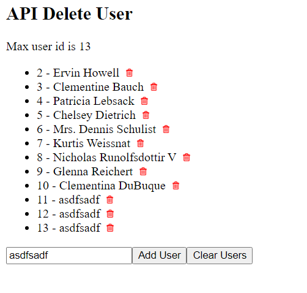

# React

## Contents

- [React](#react)
  - [Contents](#contents)
  - [Overview](#overview)
  - [Single File React HTML Pages](#single-file-react-html-pages)
  - [Standalone Projects](#standalone-projects)
  - [Resources](#resources)
  - [Introduction](#introduction)
  - [NPM Node Package Manager](#npm-node-package-manager)
  - [NPX Node Package Execute](#npx-node-package-execute)
  - [Starter Code](#starter-code)
  - [Component (think of as a class)](#component-think-of-as-a-class)
    - [CreateElement From Component (think of instantiating a class)](#createelement-from-component-think-of-instantiating-a-class)
    - [Render Method](#render-method)
    - [Rendering An Element In Raw HTML](#rendering-an-element-in-raw-html)
  - [Elements](#elements)
  - [Render Method](#render-method-1)
  - [React Clock](#react-clock)
  - [Components](#components)
  - [Display Component](#display-component)
  - [Multiple Components](#multiple-components)
  - [Component As A Separate File](#component-as-a-separate-file)
  - [Passing Data To Components](#passing-data-to-components)
  - [Component As A Class](#component-as-a-class)
  - [createElement](#createelement)
  - [React Router](#react-router)
  - [State](#state)
  - [State inside one component](#state-inside-one-component)
    - [Passing state between components](#passing-state-between-components)
    - [Child Component With Own State](#child-component-with-own-state)
    - [Alter Child State From Parent](#alter-child-state-from-parent)
  - [Alter Parent State From Child](#alter-parent-state-from-child)
  - [Buttons](#buttons)
  - [API Javascript Fetch](#api-javascript-fetch)
  - [Resources](#resources-1)
  - [Javascript Fetch](#javascript-fetch)
  - [API Post](#api-post)
  - [API Put](#api-put)
  - [Async Delete](#async-delete)
  - [API Delete](#api-delete)
  - [Add User With Max ID](#add-user-with-max-id)
  - [Edit User](#edit-user)
  - [API Google Calendar](#api-google-calendar)
  - [API Google Calendar](#api-google-calendar-1)
  - [Getting data](#getting-data)
  - [API Google Calendar](#api-google-calendar-2)
  - [Google Calendar API using `try it`](#google-calendar-api-using-try-it)
  - [React with Google Calendar](#react-with-google-calendar)
  - [React With Google Maps](#react-with-google-maps)
  - [JSX](#jsx)

## Overview

This is a teaching repository for React created by Facebook.

The repo is sorted into [single file react projects](SingleHtmlFiles) which can be run as standalone files ie they have React imported as a CDN into a single HTML file.  

This repository is a combination of my own learning, also learning React from Udemy's web developer course of 2018, and also from Egghead which has a course on React.

Also I have a much more complex set of standalone projects built with the `create-react-app` [here](StandaloneProjects).

## Single File React HTML Pages

[Single File React HTML Pages](SingleHtmlFiles/README.md)

## Standalone Projects

[React Projects Built With `create-react-app`](StandaloneProjects/README.md)

[API Projects](StandaloneProjects/api/README.md)

## Resources

[reactforbeginners.com](https://reactforbeginners.com/)

[React Learning Path](https://medium.com/free-code-camp/learning-react-roadmap-from-scratch-to-advanced-bff7735531b6)

[Build This Game On React Docs Tutorial](https://reactjs.org/tutorial/tutorial.html)

[FreeCodeCamp React Tutorial](https://www.freecodecamp.org/news/all-the-fundamental-react-js-concepts-jammed-into-this-single-medium-article-c83f9b53eac2/)

Free React Course https://scrimba.com/learn/learnreact

[Live Play Around With React And Learn Basics - All In Browser](https://jscomplete.com/playground)

Examples - https://www.jqwidgets.com

[Facebook React Tutorial] https://facebook.github.io/react/tutorial/tutorial.html


## Introduction

Statement by creators of React at Facebook 

*React is, in our opinion, the premier way to build big, fast Web apps with JavaScript. It has scaled very well for us at Facebook and Instagram.*

React updates the view (render) when underlying data changes

A view exists for every 'state' of the app

'Declarative' views

'Encapsulated components' which manage their own state

Render using

	Javascript

	JSX which uses XML to store data

React Setup

https://reactjs.org/tutorial/tutorial.html

```js
choco install yarn
yarn global add create-react-app

// or
npm install -g create-react-app
create-react-app my-app
// or
npx create-react-app my-app
cd my-app
npm start
```

## NPM Node Package Manager

NPM install scripts located in `package.json`

```json
{
    "name": "Your app",
    "version":  "1.0.0",
    "scripts":  {
        "your-package":  "your-package-name"
     }
}
```

NPM links are created at `node_modules/.bin` and globally at `%AppData%/npm`

## NPX Node Package Execute

NPX was created in 2010 to manage packages

NPX comes with NPM


## Starter Code

Strip back all of the React boilerplate code and just get your bare minimum

```jsx
create-react-app myapp; cd myapp;yarn start
// remove all extra css and tests and leave 
// index.html
<!DOCTYPE html>
<html lang="en">
  <head>
    <meta charset="utf-8" />
    <link rel="icon" href="%PUBLIC_URL%/favicon.ico" />
    <meta name="viewport" content="width=device-width, initial-scale=1" />
    <meta name="theme-color" content="#000000" />
    <meta
      name="description"
      content="Web site created using create-react-app"
    />
    <link rel="apple-touch-icon" href="%PUBLIC_URL%/logo192.png" />
    <link rel="manifest" href="%PUBLIC_URL%/manifest.json" />
    <title>React App</title>
  </head>
  <body>
    <noscript>You need to enable JavaScript to run this app.</noscript>
    <div id="root"></div>
  </body>
</html>
// App.js
function App() {
  return (
    <div>
    </div>
  );
}
export default App;
// index.js
import React from 'react';
import ReactDOM from 'react-dom';
import App from './App';
ReactDOM.render(
  <React.StrictMode>
    <App />
  </React.StrictMode>,
  document.getElementById('root')
);
```
## Component (think of as a class)

Component
Input
Props
Output
Returns a HIERARCHY OF VIEWS to display via RENDER method

```js
// Sample Component code
class ShoppingList extends React.Component {
  render() {
    return (
      Shopping List for {this.props.name}
    );
  }
}
```

### CreateElement From Component (think of instantiating a class)

```js
return React.createElement('div', 
	{className: 'shopping-list'},
  	React.createElement('h1', ...),
  	React.createElement('ul', ...)
);
```

### Render Method

Returns a description of what you want to render
Returns a REACT ELEMENT which is a lightweight description of what to render
Create REACT ELEMENT using JSX language
Any Javascript expression can go inside the JSX expression
Every REACT ELEMENT is a REAL JAVASCRIPT OBJECT
React uses these instructions to render the screen


### Rendering An Element In Raw HTML

Before we talk about React let's talk about how raw HTML renders an element which goes something like this

```js
<div id="root"></div>
<script type="text/javascript">
  const rootElement = document.getElementById('root')
  const element = document.createElement('div')
  element.textContent='Hello World'
  element.className='container'
  rootElement.appendChild(element)
</script>
```


## Elements

An element can be

```jsx
const element = <div />;
```

or be user-defined with `props` passed to it

```jsx
const element = <Welcome name="Phil" />;
```


## Render Method

Returns a description of what you want to render

Returns a REACT ELEMENT which is a lightweight description of what to render

Create REACT ELEMENT using JSX language

```js
return React.createElement('div', 
  {className: 'shopping-list'},
  React.createElement('h1', ...),
  React.createElement('ul', ...)
);
```

Any Javascript expression can go inside the JSX expression

Every REACT ELEMENT is a REAL JAVASCRIPT OBJECT

React uses these instructions to render the screen


## React Clock

Here is a basic clock

```js
function tick() {
  const element = (
    <div>
      <h1>Hello, world!</h1>
      <h2>It is {new Date().toLocaleTimeString()}.</h2>
    </div>
  );
  ReactDOM.render(element, document.getElementById('root'));
}

setInterval(tick, 1000);
```

The setInterval function calls function tick() every second.

This function tick() calls ReactDOM.render() so this gets called every second.

It renders the chosen element, in this case `hello world` plus a time string, to the screen at the position of the `div` element with id `root`.

React will compare the previous and current rendition of the screens in the virtual DOMs which it creates. It will then only render the changes, making for a more efficient screen re-render.

We can see this visually by `inspecting` the clock with Chrome Dev Tools and expanding to see the relevant HTML element. We can see the rest of the DOM is static but this little bit updates on every clock tick.


## Components

Components are HTML/CSS/Javascript code segments.

`props` can be passed in

`render` generates the output

	


A component can be defined most simply as a function

```jsx
function DisplayThis(props){
  return <h1>Display This {props.name}</h1>;
}
```

which is the same as

```jsx
class DisplayThis extends React.Component {
  render() {
    return <h1>Display This {this.props.name}</h1>
  }
}
const element = <DisplayThis name="Phil" />;
ReactDOM.render(
  element, document.getElementById('root')
);
```

## Display Component

We display a component thus

```jsx
create-react-app component-01
cd component-01
```

index.js is thus, and delete all other files!

```js
import React from 'react';
import ReactDOM from 'react-dom';
class DisplayThis extends React.Component {
  render() {
    return <h1>Display This {this.props.name}</h1>
  }
} 
const element = <DisplayThis name="Phil" />;
ReactDOM.render(
  element, document.getElementById('root')
);
```

## Multiple Components

```jsx
import React from 'react';
import ReactDOM from 'react-dom';

class Component01 extends React.Component {
  render() {
    return <h1>This is a component displaying here {this.props.name}</h1>
  }
} 

class Component02 extends React.Component {
  render() {
    return <h1>This is a component displaying here {this.props.name}</h1>
  }
}

class Component03 extends React.Component {
  render() {
    return <h1>This is a component displaying here {this.props.name}</h1>
  }
}

const element = 
  <>
    <Component01 name="Component01" />
    <Component02 name="Component02" />
    <Component03 name="Component03" />
  </>;

ReactDOM.render(
  element, document.getElementById('root')
);
```

## Component As A Separate File

See [Component 03](StandaloneProjects\components\README.md)

## Passing Data To Components

See [Component 04](StandaloneProjects\components\README.md)

## Component As A Class 

We can write a component as a class as well as a function

See [Component 04 and find Component02](StandaloneProjects\components\README.md)

## createElement

```js
return React.createElement('div', 
	{className: 'shopping-list'},
  	React.createElement('h1', ...),
  	React.createElement('ul', ...)
);
```

## React Router

See [router](router) for examples on routing

We can now route between components!

```js
create-react-app router-01;cd router-01;yarn start
yarn add react-router-dom
```

Remove all extra data and add 2 components

```jsx
import Component01 from './components/Component01'
import Component02 from './components/Component02'
function App() {
  return (
    <div>
      <h2>React Routing</h2>
      <Component01 />
      <Component02 />
    </div>
  );
}
export default App;
```

```jsx
import React from 'react';
class Component01 extends React.Component {
    render() {
        return(<div>Component01</div>);  
    }
}
export default Component01    
```

Now can we add routing between those components?

index.js

```jsx
import React from 'react';
import ReactDOM from 'react-dom';
import { BrowserRouter } from 'react-router-dom';
import App from './App';
ReactDOM.render(
  <React.StrictMode>
    <BrowserRouter>
      <App />
    </BrowserRouter>
  </React.StrictMode>,
  document.getElementById('root')
);
```

App.js

```jsx
import React from 'react';
import { Link, Route, Switch } from 'react-router-dom';
import Home from './components/Home'
import Component01 from './components/Component01'
import Component02 from './components/Component02'
function App() {
  return (
    <div>
      <h2>React Routing</h2>
      <Link to="/">Home</Link>&nbsp;|&nbsp;
      <Link to="/component01">Component01</Link>&nbsp;|&nbsp;
      <Link to="/component02">Component02</Link>
      <br /><br />
      <Switch>
        <Route path='/' component={Home} exact />
        <Route path='/component01' component={Component01} />
        <Route path='/component02' component={Component02} />
      </Switch>
    </div>
  );
}
export default App;
```

Home component etc

```jsx
import React from 'react'
class Home extends React.Component {
    render() {
        return(<div>Home</div>)
    }
}
export default Home
```

We now have perfect routing

<p align="center"></p>

## State

[State](state/README.md)

## State inside one component

Props are `immutable`

State is `mutable`

State must be used in components declared as a `Class`

Let's create state in a component

```jsx
import React from 'react'
class State01 extends React.Component {
    constructor() {
        super()
        this.state = {
            data: "State Data"
        }
    }
    render(){
        return <div>Component To Track State showing data '{this.state.data}'</div>;
    }
}
export default State01
/*
Component To Track State showing data 'State Data'
*/
```

### Passing state between components

Now let's create a sub-component and pass state to it

```js
create-react-app state-02;cd state-02;yarn add react-router-dom
```

```jsx
import React from 'react';
import ReactDOM from 'react-dom';
import { BrowserRouter } from 'react-router-dom';
import App from './App';
ReactDOM.render(
  <React.StrictMode>
    <BrowserRouter>
      <App />
    </BrowserRouter>
  </React.StrictMode>,
  document.getElementById('root')
);
```

We create the parent component

```jsx
import ParentComponent from 'components/ParentComponent.js'
function App() {
  return (
    <div>
      <ParentComponent />
    </div>
  );
}
export default App;
```

```jsx
import ParentComponent from './components/ParentComponent.js'
function App() {
  return (
    <div>
      <ParentComponent />
    </div>
  );
}
export default ParentComponent;
```

```jsx
import React from 'react';
class ParentComponent extends React.Component {
    render() {
        return (<div>This is the parent component</div>);
    }
}
export default ParentComponent
/*
This is the parent component
*/
```

Now let's add a child component

```jsx
import React from 'react';
import ChildComponent from './ChildComponent';
class ParentComponent extends React.Component {
    render() {
        return (
            <div>
                This is the parent component
                <ChildComponent />
            </div>
        );
    }
}
export default ParentComponent
/*
This is the parent component
This is the Child component
*/
```

Now let's see if we can pass state data to the child

```jsx
import React from 'react';
import ChildComponent from './ChildComponent';
class ParentComponent extends React.Component {
    constructor() {
        super()
        this.state = {
            data: "This is some data"
        }
    }
    render() {
        return (
            <div>
                This is the parent component
                <ChildComponent text='This is some text' />
                <ChildComponent text={this.state.data} />
            </div>
        );
    }
}
export default ParentComponent
```

```jsx
import React from 'react';
class ChildComponent extends React.Component {
    render() {
        return (
            <div>
                <p>This is the Child component with data from parent - {this.props.text}</p>
            </div>
        );
    }
}
export default ChildComponent
/*
This is the parent component
This is the Child component with data from parent - This is some text
This is the Child component with data from parent - This is some data
*/
```

So we are now able to pass data or 'state' from one component down to another one.

The idea is that if the state updates, then so does the state in the child component.

Let's see if we can set this up by clicking a button in the parent to change state and see what happens in the child component display

```js
create-react-app state-03;cd state-03;yarn start
// remove all extra css and tests
// App.js
function App() {
  return (
    <div>
    </div>
  );
}
export default App;
// index.js
import React from 'react';
import ReactDOM from 'react-dom';
import App from './App';
ReactDOM.render(
  <React.StrictMode>
    <App />
  </React.StrictMode>,
  document.getElementById('root')
);
```

Now if we push some data from `Parent`

```jsx
import React from 'react'
import Child from './Child'
class Parent extends React.Component {
    constructor(){
        super()
        this.state = {
            data: "here is some data"
        }
    }
    render(){
        return(
            <>
                <h2>Parent Component</h2>
                <Child data={this.state.data}/>
            </>
        );
    }
}
export default Parent
```

to Child

```jsx
import React from 'react'
class Child extends React.Component {
    render(){
        return(
            <>
                <p>Child Component</p>
                <p>{this.props.data}</p>
            </>
        );
    }
}
export default Child
```

This is all working fine

```jsx
/*
Parent Component
Child Component
here is some data
*/
```

So what now if we add a button in the parent to change the data in the parent and see if this propogates down to the child immediately.

We use the `setState` method to set the state, we don't call it directly

```jsx
import React from 'react'
import Child from './Child'
class Parent extends React.Component {
    constructor(){
        super()
        this.state = {
            data: "here is some data",
            isToggleOn:true
        }
        this.changeState = this.changeState.bind(this);
    }
    changeState() {
        this.setState(state=>({
            data: state.data + " some data, ",
            isToggleOn:!state.isToggleOn
        }))
    } 
    render(){
        return(
            <>
                <h2>Parent Component</h2>
                <Child data={this.state.data}/>
                <button onClick={this.changeState}>Change State {this.state.isToggleOn ? 'ON' : 'OFF'}</button>
            </>
        );
    }
}
export default Parent
/*
Parent Component
Child Component
here is some data
Change State ON

becomes

Parent Component
Child Component
here is some data some data,
Change State OFF
*/
```

### Child Component With Own State

We can create a child component with its own state

```jsx
import React from 'react'
class Child extends React.Component {
    state = {
        name: "Child State"
    }
    render(){
        return(
            <div>
              <h3>Here is a child rendering its own state as `{this.state.name}`</h3>
            </div>
        )
    }
}
export default Child
/*
Here is a child rendering its own state as `Child State`
*/
```

### Alter Child State From Parent

We have passed state from parent to child component.

Now what if we want to alter the state of a child from the parent.

```jsx
// App.js
import Parent from './components/Parent'
function App() {
  return (
    <div>
      <h1>Here is an app</h1>
      <Parent/>
      <Parent/>
    </div>
  );
}
export default App;
// Parent.js
import React from 'react'
import Child from './Child'
class Parent extends React.Component {
    render(){
        return(
            <div>
             <h2>Here is a parent</h2>
             <Child />
             <Child />
             <Child />
            </div>
        )
    }
}
export default Parent
// Child.js
import React from 'react'
class Child extends React.Component {
    render(){
        return(
            <div>
              <h3>Here is a child</h3>
            </div>
        )
    }
}
export default Child
/*
Here is an app
Here is a parent
Here is a child
*/
```

Now let's add state to the child with a button to alter it

```jsx
import React from 'react'
class Child extends React.Component {
    state = {
        name: "Child State"
    }
    changeName = () => {
        this.setState ({name:"Altered Child State"})
    }
    render(){
        return(
            <div>
              <h3>Here is a child rendering its own state as `{this.state.name}`</h3>
              <button onClick={this.changeName}>Change Name From Child</button>
            </div>
        )
    }
}
export default Child
/*
Here is an app
Here is a parent
Here is a child rendering its own state as `Child State`
Change Name From Child

becomes after click

Here is an app
Here is a parent
Here is a child rendering its own state as `Altered Child State`
Change Name From Child
*/
```

Now this is the child component altering its own state.

Can we achieve the same result from the parent also?

```jsx
import React from 'react'
import Child from './Child'
class Parent extends React.Component {
    constructor(){
        super()
        this.referenceChild = React.createRef();
    }
    changeChildState = ()=>{
        this.referenceChild.current.changeName()
    }
    render(){
        return(
            <div>
             <h2>Here is a parent</h2>
             <Child ref={this.referenceChild} />
             <button onClick={this.changeChildState}>Change child name (held in child state) from Parent</button>
            </div>
        )
    }
}
export default Parent
```

Now we can click on both the child and parent elements, and achieve the same result of altering props in the child element


## Alter Parent State From Child

We have seen how to alter child state from parent, but what about altering the parent state from the child?

In this case we actually pass a function down into the child and activate that function, which alters the parent element.

```jsx
// app
import Parent from './components/Parent'
function App() {
  return (
    <div>
      Here is an App
      <Parent/>
    </div>
  );
}
export default App;
// parent
import React from 'react'
import Child from './Child'
class Parent extends React.Component {
    render(){
        return(
            <div>
                Here is a Parent
                <Child/>
            </div>
        )
    }
}
export default Parent
// child
import React from 'react'
class Child extends React.Component {
    render(){
        return(
            <div>
                Here is a child
            </div>
        )
    }
}
export default 
/*
Here is an App
Here is a Parent
Here is a child
*/
```

So let's create the state in the parent which can be altered

```jsx
import React from 'react'
import Child from './Child'
class Parent extends React.Component {
    constructor(){
        super()
        this.state = {
            data: "This is parent data"
        }
        this.changeState = this.changeState.bind(this)
    }
    changeState(){
        this.setState(state=>({
            data:"This is altered parent data"            
        }))
    }
    render(){
        return(
            <div>
                <p>Here is a Parent with some data - {this.state.data}</p>
                <button onClick={this.changeState}>Change parent state from parent</button>
                <Child/>
            </div>
        )
    }
}
export default Parent
/*
Here is a Parent with some data - This is altered parent data
*/
```

Now we can alter the parent state from the parent but what about altering the parent state from the child?

Just send the handler function into the child

```jsx
// Parent
import React from 'react'
import Child from './Child'
class Parent extends React.Component {
    constructor(){
        super()
        this.state = {
            data: "This is parent data"
        }
        this.changeState = this.changeState.bind(this)
    }
    changeState(){
        this.setState(state=>({
            data:"This is altered parent data"            
        }))
    }
    render(){
        return(
            <div>
                <p>Here is a Parent with some data - {this.state.data}</p>
                <button onClick={this.changeState}>Change parent state from parent</button>
                <Child action={this.changeState} />
            </div>
        )
    }
}
export default Parent
// Child
import React from 'react'
class Child extends React.Component {
    render(){
        return(
            <div>
                <p>Here is a child</p>
                <button onClick={this.props.action}>Click here to alter parent state from child</button>
            </div>
        )
    }
}
export default Child
/*
Here is an App
Here is a Parent with some data - This is altered parent data
Click here to alter parent state from child
*/
```

So now we can alter state both from parent to child but also child to parent.


## Buttons

When we click a button the code to trigger an event is as follows

```jsx
import React from 'react'
import Child from './Child'
class Parent extends React.Component {
    constructor(){
        super()
        this.state = {
            data: "here is some data",
            isToggleOn:true
        }
        this.changeState = this.changeState.bind(this);
    }
    changeState() {
        this.setState(state=>({
            data: state.data + "some data, ",
            isToggleOn:!state.isToggleOn
        }))
    } 
    render(){
        return(
            <>
                <h2>Parent Component</h2>
                <Child data={this.state.data}/>
                <button onClick={this.changeState}>Change State {this.state.isToggleOn ? 'ON' : 'OFF'}</button>
            </>
        );
    }
}
export default Parent
```

## API Javascript Fetch

Let's try and read data from an API to our react page using Javascript fetch

## Resources

https://www.smashingmagazine.com/2020/06/rest-api-react-fetch-axios/

https://www.youtube.com/watch?v=T3Px88x_PsA&ab_channel=BenAwad

https://api.randomuser.me

## Javascript Fetch

Using https://reactjs.org/docs/faq-ajax.html as a lead document

```js
create-react-app api-fetch-01;cd api-fetch-01
// strip out to bare minimum
```

```jsx
import React from 'react'
class Parent extends React.Component {
    constructor(){
        super()
        this.state={
            error:null,
            isLoaded:false,
            todos:[]
        }
    }
    componentDidMount(){
        fetch('https://jsonplaceholder.typicode.com/todos')
        .then(response => response.json())
        .then(data => {
            this.setState({
                isLoaded:true,
                todos:data
            })
            console.log(this.state)
        },
        error => {
            this.setState({
                isLoaded:true,
                error
            });
        });
    }
    render(){
        return(
            <div>
                This is an API client
            </div>
        )
    }
}
export default Parent
/*
Object
error: null
isLoaded: true
todos: Array(200)
[0 … 99]
0: {userId: 1, id: 1, title: "delectus aut autem", completed: false}
1: {userId: 1, id: 2, title: "quis ut nam facilis et officia qui", completed: false}
2: {userId: 1, id: 3, title: "fugiat veniam minus", completed: false}
*/
```

Now to render the data also

```jsx
render(){
    const { error, isLoaded, todos } = this.state;
    if(error) {
        return <div>Error: {error.message}</div>
    } else if (!isLoaded) {
        return <div>Loading . . . </div>
    } else {
        return(
            <ul>
                {todos.map(todo=>(
                    <li key={todo.id}>{todo.title}</li>
                ))}
            </ul>
        )    
    }
}
/*
API Client
delectus aut autem
quis ut nam facilis et officia qui
fugiat veniam minus
*/
```

## API Post

Now can we POST data?

Let's use https://jsonplaceholder.typicode.com/users for now although I'm not sure if we can actually return a new user id

First of all set up the code to read data using API Get 

```jsx
import React from 'react'
class ApiPost extends React.Component {
    constructor(){
        super()
        this.state = {
            error:null,
            isLoaded:false,
            users:[]
        }
    }
    componentDidMount(){
        fetch("https://jsonplaceholder.typicode.com/users")
            .then(response=>response.json())
            .then(data=>{
                this.setState({
                    isLoaded:true,
                    users:data
                })
            },
            error=>{
                this.setState({
                    isLoaded:true,
                    error
                })
            }
        );
    }
    render(){
        const { error, isLoaded, users } = this.state
        if(error) {
            return <div>Error : {error.message}</div>
        } else if (!isLoaded) {
            return <div>Loading ...</div>
        } else {
            return(
                <div>
                    <h2>API Post New User</h2>
                    <ul>
                        {users.slice(0,3).map(user=>(
                            <li key={user.id}>{user.name}</li>
                        ))}
                    </ul>
                </div> 
            )
        }
    }
}
export default ApiPost
```

Next to do a `post` we install `axios`

```js
yarn add axios
yarn start
```

and after a lot of work we end up with a working API POST page

```jsx
import React from 'react'
import axios from 'axios'
class ApiPost extends React.Component {
    constructor(){
        super()
        this.state = {
            error:null,
            isLoaded:false,
            users:[],
            user:null,
            fullName:''
        }
    }
    componentDidMount(){
        fetch("https://jsonplaceholder.typicode.com/users")
            .then(response=>response.json())
            .then(data=>{
                this.setState({
                    error:null,
                    isLoaded:true,
                    users:data,
                    user:null,
                    fullName:''
                })
            },
            error=>{
                this.setState({
                    isLoaded:true,
                    error
                })
            }
        );
        const user = {name:"Bob"};
        axios.post('https://jsonplaceholder.typicode.com/users', user)
            .then(response => {
                console.log(response);
                console.log(response.data)
                this.setState({ 
                    user:response.data
                    
                }); 
            });
    }
    onClearUsers = () => {
        this.setState({users:[]})
    }
    onChangeUserName = event => {
        this.setState({fullName:event.target.value})
        console.log(event.target.value)
    }
    onAddUser = () => {
        let user = {
            name:this.state.fullName
        }
        let users = this.state.users
        axios.post('https://jsonplaceholder.typicode.com/users', user)
            .then(response => {
                user = response.data
                user.id = this.state.users.length+1
                console.log(user)
                users = [...this.state.users, user]
                console.log(users)
                this.setState({ 
                    user,
                    users
                })
            });

    }
    render(){
        const { error, isLoaded, users } = this.state
        if(error) {
            return <div>Error : {error.message}</div>
        } else if (!isLoaded) {
            return <div>Loading ...</div>
        } else {
            return(
                <div>
                    <h2>API Post New User</h2>
                    <ul>
                        {users.map(user=>(
                            <li key={user.id}>{user.name}</li>
                        ))}
                    </ul>
                    <input type="text" value={this.state.fullName} onChange={this.onChangeUserName} placeholder='Full Name' />
                    <button type='button' onClick={this.onAddUser} disabled={!this.state.fullName}>Add User</button>
                    <button type='button' onClick={this.onClearUsers}>Clear Users</button>
                </div> 
            )
        }

    }
}
export default ApiPost
```

## API Put

Now we can look at API Put for example at https://www.robinwieruch.de/react-state-array-add-update-remove and https://www.robinwieruch.de/react-update-item-in-list

Create a new react application

```js
create-react-app api-put-01
cd api-put-01
yarn add axios react-router-dom
yarn start
```

Add in this code

```jsx
onDeleteUserSubmit = event => {
    event.preventDefault()
    axios.delete(`https://jsonplaceholder.typicode.com/users/${this.state.id}`)
        .then(response=>{
            console.log(`response has status ${response.status}`)
            console.log(response)
            console.log(response.data)
            let users = this.state.users.filter(user=>{
                return user.id != this.state.id
            })
            console.log(users)
            this.setState({
                users,
                id:''
            })
        })
}
<form onSubmit={this.onDeleteUserSubmit}>
    ID<input type="text" name="id" onChange={this.onDeleteUser} />
    <button type="submit">Delete User</button>
</form>
```

The final code for a crude delete is here

```jsx
import React from 'react'
import axios from 'axios'
class ApiPost extends React.Component {
    constructor(){
        super()
        this.state = {
            error:null,
            isLoaded:false,
            users:[],
            user:null,
            fullName:'',
            id:''
        }
    }
    componentDidMount(){
        fetch("https://jsonplaceholder.typicode.com/users")
            .then(response=>response.json())
            .then(data=>{
                this.setState({
                    error:null,
                    isLoaded:true,
                    users:data,
                    user:null,
                    fullName:''
                })
            },
            error=>{
                this.setState({
                    isLoaded:true,
                    error
                })
            }
        );
        const user = {name:"Bob"};
        axios.post('https://jsonplaceholder.typicode.com/users', user)
            .then(response => {
                console.log(response);
                console.log(response.data)
                this.setState({ 
                    user:response.data
                    
                }); 
            });
    }
    onChangeUserName = event => {
        this.setState({fullName:event.target.value})
        console.log(event.target.value)
    }
    onClearUsers = () => {
        this.setState({users:[]})
    }
    onAddUser = () => {
        let user = {
            name:this.state.fullName
        }
        let users = this.state.users
        axios.post('https://jsonplaceholder.typicode.com/users', user)
            .then(response => {
                user = response.data
                const idMax = this.state.idMax+1
                user.id = this.state.idMax
                console.log(user)
                users = [...this.state.users, user]
                console.log(users)
                this.setState({ 
                    user,
                    users,
                    idMax
                })
            });
    }
    onDeleteUser = event => {
        this.setState({id:event.target.value})
    }
    onDeleteUserSubmit = event => {
        event.preventDefault()
        axios.delete(`https://jsonplaceholder.typicode.com/users/${this.state.id}`)
            .then(response=>{
                console.log(`response has status ${response.status}`)
                console.log(response)
                console.log(response.data)
                let users = this.state.users.filter(user=>{
                    return user.id != this.state.id
                })
                console.log(users)
                this.setState({
                    users,
                    id:''
                })
            })
    }
    render(){
        const { error, isLoaded, users } = this.state
        if(error) {
            return <div>Error : {error.message}</div>
        } else if (!isLoaded) {
            return <div>Loading ...</div>
        } else {
            return(
                <div>
                    <h2>API Delete User</h2>
                    <ul>
                        {users.map(user=>(
                            <li key={user.id}>{user.id} - {user.name}</li>
                        ))}
                    </ul>
                    <input type="text" value={this.state.fullName} onChange={this.onChangeUserName} placeholder='Full Name' />
                    <button type='button' onClick={this.onAddUser} disabled={!this.state.fullName}>Add User</button>
                    <button type='button' onClick={this.onClearUsers}>Clear Users</button>
                    <form onSubmit={this.onDeleteUserSubmit}>
                        ID<input type="text" name="id" onChange={this.onDeleteUser} />
                        <button type="submit">Delete User</button>
                    </form>
                </div> 
            )
        }

    }
}
export default ApiDelete
```

## Async Delete

We can modify the code slightly to have an async delete.  Just taking this tutorial as a lead for this work, although creating my own example from the lead in the tutorial https://www.robinwieruch.de/react-remove-item-from-list

```jsx
onDeleteUserSubmit = async event => {
    event.preventDefault()
    const response = await axios.delete(`https://jsonplaceholder.typicode.com/users/${this.state.id}`)
    console.log(`response has status ${response.status}`)
    console.log(response)
    console.log(response.data)
    let users = this.state.users.filter(user=>user.id != this.state.id)
    console.log(users)
    this.setState({
        users,
        id:'',
        firstName:'',
        user:null
    })
}
```

## API Delete

We can now move forwards with deleting a user by adding a button on every user which stores the id of that user, to make it much easier to delete a user

```jsx
removeUser = async event => {
    const id = event.target.value
    const userUrl = `https://jsonplaceholder.typicode.com/users/${id}`
    console.log(`attempting to delete ${userUrl}`)
    const response = await axios.delete(userUrl)
    console.log(`response has status ${response.status}`)
    console.log(response)
    console.log(response.data)
    let users = this.state.users.filter(user=>user.id !== parseInt(id))
    console.log(users)
    this.setState({
        users,
        id:'',
        firstName:'',
        user:null
    })
}
render(){
    const { error, isLoaded, users } = this.state
    if(error) {
        return <div>Error : {error.message}</div>
    } else if (!isLoaded) {
        return <div>Loading ...</div>
    } else {
        return(
            <div>
                <h2>API Delete User</h2>
                <ul>
                    {users.map(user=>(
                        <li key={user.id}>{user.id} - {user.name}<button value={user.id} onClick={this.removeUser}>delete</button></li>
                    ))}
                </ul>
                <input type="text" value={this.state.fullName} onChange={this.onChangeUserName} placeholder='Full Name' />
                <button type='button' onClick={this.onAddUser} disabled={!this.state.fullName}>Add User</button>
                <button type='button' onClick={this.onClearUsers}>Clear Users</button>
                <form onSubmit={this.onDeleteUserSubmit}>
                    ID<input type="text" name="id" onChange={this.onDeleteUser} />
                    <button type="submit">Delete User</button>
                </form>
            </div> 
        )
    }
}
```

## Add User With Max ID

We now have a problem in that when we delete a user, we are taking the new id from the length of the array.  This was OK before we started deleting users!

To fix this I have added a new idMax item in state, and we want to update this
- on creation - go through the array and find the max value
- on adding a new user - increment this max value by 1 and again keep it in state

Here is the new code to add a user and refer to the maximum id so we are not bothered when we start deleting users

```jsx
import React from 'react'
import axios from 'axios'
class ApiDelete2 extends React.Component {
    constructor(){
        super()
        this.state = {
            error:null,
            isLoaded:false,
            users:[],
            user:null,
            fullName:'',
            id:'',
            idMax:''
        }
    }
    componentDidMount(){
        fetch("https://jsonplaceholder.typicode.com/users")
            .then(response=>response.json())
            .then(data=>{
                const users = data
                let idMax = users.reduce( (max, user) => parseInt(user.id)>max ? parseInt(user.id) : max, parseInt(users[0].id))
                console.log(`Max ID value is ${idMax}`)
                this.setState({
                    error:null,
                    isLoaded:true,
                    users,
                    user:null,
                    fullName:'',
                    idMax
                })
            },
            error=>{
                this.setState({
                    isLoaded:true,
                    error
                })
            }
        );
    }
    onChangeUserName = event => {
        this.setState({fullName:event.target.value})
        console.log(event.target.value)
    }
    onClearUsers = () => {
        this.setState({users:[]})
    }
    onAddUser = () => {
        let user = {
            name:this.state.fullName
        }
        let users = this.state.users
        axios.post('https://jsonplaceholder.typicode.com/users', user)
            .then(response => {
                user = response.data
                const idMax = this.state.idMax + 1
                user.id = idMax
                console.log(user)
                users = [...this.state.users, user]
                console.log(users)
                console.log(`id max is ${idMax}`)
                this.setState({ 
                    user,
                    users,
                    idMax
                })
            });
    }
    onDeleteUser = event => {
        this.setState({id:event.target.value})
    }
    onDeleteUserSubmit = async event => {
        event.preventDefault()
        const id = this.state.id
        const response = await axios.delete(`https://jsonplaceholder.typicode.com/users/${id}`)
        console.log(`response has status ${response.status}`)
        console.log(response)
        console.log(response.data)
        let users = this.state.users.filter(user=>user.id !== parseInt(id))
        console.log(users)
        this.setState({
            users,
            id:'',
            firstName:'',
            user:null
        })
    }
    removeUser = async event => {
        const id = event.target.value
        const userUrl = `https://jsonplaceholder.typicode.com/users/${id}`
        console.log(`attempting to delete ${userUrl}`)
        const response = await axios.delete(userUrl)
        console.log(`response has status ${response.status}`)
        console.log(response)
        console.log(response.data)
        let users = this.state.users.filter(user=>user.id !== parseInt(id))
        console.log(users)
        this.setState({
            users,
            id:'',
            firstName:'',
            user:null
        })
    }
    render(){
        const { error, isLoaded, users } = this.state
        if(error) {
            return <div>Error : {error.message}</div>
        } else if (!isLoaded) {
            return <div>Loading ...</div>
        } else {
            return(
                <div>
                    <h2>API Delete User</h2>
                    <p>Max user id is {this.state.idMax}</p>
                    <ul>
                        {users.map(user=>(
                            <li key={user.id}>{user.id} - {user.name}<button value={user.id} onClick={this.removeUser}>delete</button></li>
                        ))}
                    </ul>
                    <input type="text" value={this.state.fullName} onChange={this.onChangeUserName} placeholder='Full Name' />
                    <button type='button' onClick={this.onAddUser} disabled={!this.state.fullName}>Add User</button>
                    <button type='button' onClick={this.onClearUsers}>Clear Users</button>
                    <form onSubmit={this.onDeleteUserSubmit}>
                        ID<input type="text" name="id" onChange={this.onDeleteUser} />
                        <button type="submit">Delete User</button>
                    </form>
                </div> 
            )
        }

    }
}
export default ApiDelete2
```

Now even when we remove a user we are retaining the maximum user value

The final stage now is to change our delete button into a proper `delete` icon

index.html

```jsx
<!DOCTYPE html>
<html lang="en">
  <head>
    <meta charset="utf-8" />
    <link rel="icon" href="%PUBLIC_URL%/favicon.ico" />
    <meta name="viewport" content="width=device-width, initial-scale=1" />
    <title>API Put Data</title>
    <style>
      .iconDelete{
        width:0.7vw;
      }
    </style>
  </head>
  <body>
    <div id="root"></div>
  </body>
</html>
```

And the full application up to this point which lists, adds and deletes users is

```jsx
import React from 'react'
import axios from 'axios'
class ApiDelete2 extends React.Component {
    constructor(){
        super()
        this.state = {
            error:null,
            isLoaded:false,
            users:[],
            user:null,
            fullName:'',
            id:'',
            idMax:''
        }
    }
    componentDidMount(){
        fetch("https://jsonplaceholder.typicode.com/users")
            .then(response=>response.json())
            .then(data=>{
                const users = data
                let idMax = users.reduce( (max, user) => parseInt(user.id)>max ? parseInt(user.id) : max, parseInt(users[0].id))
                console.log(`Max ID value is ${idMax}`)
                this.setState({
                    error:null,
                    isLoaded:true,
                    users,
                    user:null,
                    fullName:'',
                    idMax
                })
            },
            error=>{
                this.setState({
                    isLoaded:true,
                    error
                })
            }
        );
    }
    onChangeUserName = event => {
        this.setState({fullName:event.target.value})
        console.log(event.target.value)
    }
    onClearUsers = () => {
        this.setState({users:[]})
    }
    onAddUser = () => {
        let user = {
            name:this.state.fullName
        }
        let users = this.state.users
        axios.post('https://jsonplaceholder.typicode.com/users', user)
            .then(response => {
                user = response.data
                const idMax = this.state.idMax + 1
                user.id = idMax
                console.log(user)
                users = [...this.state.users, user]
                console.log(users)
                console.log(`id max is ${idMax}`)
                this.setState({ 
                    user,
                    users,
                    idMax
                })
            });
    }
    removeUser = async event => {
        const id = event.target.value
        const userUrl = `https://jsonplaceholder.typicode.com/users/${id}`
        console.log(`attempting to delete ${userUrl}`)
        const response = await axios.delete(userUrl)
        console.log(`response has status ${response.status}`)
        console.log(response)
        console.log(response.data)
        let users = this.state.users.filter(user=>user.id !== parseInt(id))
        console.log(users)
        this.setState({
            users,
            id:'',
            firstName:'',
            user:null
        })
    }
    render(){
        const { error, isLoaded, users } = this.state
        if(error) {
            return <div>Error : {error.message}</div>
        } else if (!isLoaded) {
            return <div>Loading ...</div>
        } else {
            return(
                <div>
                    <h2>API Delete User</h2>
                    <p>Max user id is {this.state.idMax}</p>
                    <ul>
                        {users.map(user=>(
                            <li key={user.id}>{user.id} - {user.name} &nbsp; 
                                <input type="image" src="data:image/png;base64,iVBORw0KGgoAAAANSUhEUgAAAOEAAADhCAMAAAAJbSJIAAAAh1BMVEX/////AAD/WVn/oKD/p6f/5ub/9vb/xcX/kZH/Kir/LS3/VVX/vb3/rKz/1dX/RET/TEz/y8v/s7P/ZGT/9fX/Ozv/Njb/t7f/3Nz/m5v/lZX/hIT/7e3/Ghr/aGj/0ND/Pz//b2//eXn/R0f/6Oj/fX3/Gxv/Dg7/c3P/i4v/goL/IyP/ZmaQsKNcAAAFP0lEQVR4nO2da3OiPBiGiyK2VbRuFVEs4mm12/3/v+/18M5OhztqEkMS6H19dELmuQRCznl6qpBou+xP4zgMw/YVwjCedtNFlUFUx3iafwWSvM1S1+Eqs81eZPUutPquQ1ais1PTO5NMXYctz0zD70SxdB25HINCU/DIZ+Q6eglCfb8jm47r+O+yekjwiOdP6rj3qGAQeF3gRG+PCwaBz98NA3fwRNe1x1VyM4JB4GsN57FS9DuFnx+NgTHBINi5lhERDQ0aevkqmntGT7y41kEio4JBELoWAszewiDYe1fYXGkO7nufcXc0GKSdC+mFwYnlqNtv767V09uujUr0hVH+bm/vXzoSV4Qmnt3Ed1GQa8kOmFioOKo2YkUWe0GIc+nLlyLDrMJ41RE9pH8UrhcpvlYWrQ4HDLBQykBUFHtVO319+DUSNEviamLVYoHhtRSz6GIWq0pi1WOE4Sm31Cdev4j4Fu3HqnnM8V+qIlRNniG4N+U8BMWpR+MZ2MUt/y38Bxp61LOI3RcaHWZo6NHnogXBafSXfdTLUKONjq0TGpokuonoKb19hSgTNBzcu8QEnfb6vTccTpLJ6w2wZfF1K7kYyCN4uZE6mSTF8K2Xfz7WZzXWGem0TfKAY/rbdfRyPGvfwcR16LLotkIENUVP+VCuBV+ozS3UHXNMXYetwEHLcOo6bAUSLUPdOSNO0DLMXEetglZTcu06ahW0mpLNN1y5jloFGtLQf7QMjc2OsYGKYTcZntnUpOl0obgEXcgMJtSpsobIVN/E49V1gYb1N5zQkIbe03zDQsJQMKBeIzY0/BGGgnkVNUJm/oBwjllt6DX+HsoYNv8emlxUYB+Z9uE2O7I+rPMjrTMwwrtpOQIa5cX55795/ne1PuyOgeuNs8EYlLPZuzCB0dAiMH8MYUa4oZV8NLQHDXWhoT1oqAsN7UFDXWhoDxrqQkN7VGUIK5KgVTYelMA56OUUA1g/uyinwJHrzd1I9ICtBCBf6GPdl1N0yimCz3KSdjkF9gzej8SaIWwYgIYwdRmWh2GvEg1pSEMa0pCGNKQhDWlIQxrSkIY0pCENaUhDGtKQhjSkIQ1p6Lsh7GUMI6+2DO+P1eoBI6+/HBlGYGho63YYPachDWlIQxrSkIY0pCENaUhDGtKQhjSk4Q83hH3bm2Y4piENafgP2F6DhjSkIQ0fBc7J8cfQ0GpWGtKQhjSkIQ1rZIht/KYZjuF4vcYZftGQhrKGYeMN2zSkIQ1pSEMa0pCGNNQ2XMCe7I0z/Ph5hkszhu/lfGfeGA5oSEMa0pCG3hrOG28IwVky3MKZPjSk4TVD2MYZDD/uG2rsBW3PMCunWPRLwDyXqJyiD1t+d8opoFqNf5M1Q0vQUBswXJvJV5mUhrr8QMOVmXyVwcMnqzLMzeSrjD3DdzP5KoNHpFZlKHPYZxXggdpVGcocK1wFU2uGSWQmY1Via4YBngBjhZ09QzeFqeAcX0N93ivMGfr1LbCAeXtBgGcSaYFFmKCrpnJSgaDMOeNSQAfQkZ6hv08WaB+f0DvfWMBMlHtQ5Icsy+YnZhfa3whjRb5f/H9+57yfs2y9wqLgjCnBp4U4f+dAR4g+uWsXMQZfFD/PWzf6zTq4thFhtKzburYRYPAtPAHdtc55NV05vlJeu8P49ziCPT7dAuvJH0dULXRHJRXjLazncAeM0ZrBnwe1gkf0wnjtWu3Ml6H1zUJEDSnb5OMKBY/ljevbmBja/vkGnZVLP2Mtwpukc9jNyA6rvr1Ovs7oVxy2LRLG/XShFep/9Fi4XhXtpEkAAAAASUVORK5CYII=" className="iconDelete" value={user.id} onClick={this.removeUser} />
                            </li>
                        ))}
                    </ul>
                    <input type="text" value={this.state.fullName} onChange={this.onChangeUserName} placeholder='Full Name' />
                    <button type='button' onClick={this.onAddUser} disabled={!this.state.fullName}>Add User</button>
                    <button type='button' onClick={this.onClearUsers}>Clear Users</button>
                </div> 
            )
        }

    }
}
export default ApiDelete2
```

<p align="center"></p>

## Edit User

Now let's see if we can edit a user!!!

The full and final application is here!!!

```jsx
import React from 'react'
import axios from 'axios'
class ApiPut extends React.Component {
    constructor(){
        super()
        this.state = {
            error:null,
            isLoaded:false,
            users:[],
            user:null,
            name:'',
            id:'',
            idMax:''
        }
    }
    componentDidMount(){
        fetch("https://jsonplaceholder.typicode.com/users")
            .then(response=>response.json())
            .then(data=>{
                const users = data
                let idMax = users.reduce( (max, user) => parseInt(user.id)>max ? parseInt(user.id) : max, parseInt(users[0].id))
                console.log(`Max ID value is ${idMax}`)
                this.setState({
                    error:null,
                    isLoaded:true,
                    users,
                    user:null,
                    name:'',
                    idMax
                })
            },
            error=>{
                this.setState({
                    isLoaded:true,
                    error
                })
            }
        );
    }
    onChangeUserName = event => {
        this.setState({name:event.target.value})
        console.log(event.target.value)
    }
    onClearUsers = () => {
        this.setState({users:[]})
    }
    onAddUser = () => {
        let user = {
            name:this.state.name
        }
        let users = this.state.users
        axios.post('https://jsonplaceholder.typicode.com/users', user)
            .then(response => {
                user = response.data
                const idMax = this.state.idMax + 1
                user.id = idMax
                console.log(user)
                users = [...this.state.users, user]
                console.log(users)
                console.log(`id max is ${idMax}`)
                this.setState({ 
                    user,
                    users,
                    idMax
                })
            });
    }
    removeUser = async event => {
        const id = event.target.value
        const userUrl = `https://jsonplaceholder.typicode.com/users/${id}`
        console.log(`attempting to delete ${userUrl}`)
        const response = await axios.delete(userUrl)
        console.log(`response has status ${response.status}`)
        console.log(response)
        console.log(response.data)
        let users = this.state.users.filter(user=>user.id !== parseInt(id))
        console.log(users)
        this.setState({
            users,
            id:'',
            firstName:'',
            user:null
        })
    }
    onEditUser = async () => {
        const users = this.state.users
        const user = this.state.user
        const id = user.id
        console.log(`user before editing ${user} with id ${id}`)
        console.log(this.state.user)
        const userUrl = `https://jsonplaceholder.typicode.com/users/${id}`
        user.name = this.state.name;
        console.log(`about to submit user ${id} new name ${user.name}`)
        const response = await axios.put(userUrl,user)
        console.log(`response has status ${response.status}`)
        console.log(response)
        console.log(response.data)
        this.setState({
            users,
            user,
            name:user.name,
            id
        })
    }
    selectUserForEditing = async event => {
        const users = this.state.users
        const id = event.target.value
        const user = this.state.users.filter(user=>user.id===parseInt(id))[0]
        const userUrl = `https://jsonplaceholder.typicode.com/users/${id}`
        console.log(`attempting to update ${userUrl}`)
        console.log(`selecting user with id ${id} for editing with name ${user.name}`)
        this.setState({
            users,
            id,
            name:user.name,
            user
        })
    }
    render(){
        const { error, isLoaded, users } = this.state
        if(error) {
            return <div>Error : {error.message}</div>
        } else if (!isLoaded) {
            return <div>Loading ...</div>
        } else {
            return(
                <div>
                    <h2>API Update User</h2>
                    <p>Max user id is {this.state.idMax}</p>
                    <ul>
                        {users.map(user=>(
                            <li key={user.id}>
                                {user.id} - {user.name} &nbsp; 
                                <input type="image" src="https://cdn0.iconfinder.com/data/icons/glyphpack/19/edit-512.png" className="iconEdit" value={user.id} onClick={this.selectUserForEditing} /> &nbsp;
                                <input type="image" src="data:image/png;base64,iVBORw0KGgoAAAANSUhEUgAAAOEAAADhCAMAAAAJbSJIAAAAh1BMVEX/////AAD/WVn/oKD/p6f/5ub/9vb/xcX/kZH/Kir/LS3/VVX/vb3/rKz/1dX/RET/TEz/y8v/s7P/ZGT/9fX/Ozv/Njb/t7f/3Nz/m5v/lZX/hIT/7e3/Ghr/aGj/0ND/Pz//b2//eXn/R0f/6Oj/fX3/Gxv/Dg7/c3P/i4v/goL/IyP/ZmaQsKNcAAAFP0lEQVR4nO2da3OiPBiGiyK2VbRuFVEs4mm12/3/v+/18M5OhztqEkMS6H19dELmuQRCznl6qpBou+xP4zgMw/YVwjCedtNFlUFUx3iafwWSvM1S1+Eqs81eZPUutPquQ1ais1PTO5NMXYctz0zD70SxdB25HINCU/DIZ+Q6eglCfb8jm47r+O+yekjwiOdP6rj3qGAQeF3gRG+PCwaBz98NA3fwRNe1x1VyM4JB4GsN57FS9DuFnx+NgTHBINi5lhERDQ0aevkqmntGT7y41kEio4JBELoWAszewiDYe1fYXGkO7nufcXc0GKSdC+mFwYnlqNtv767V09uujUr0hVH+bm/vXzoSV4Qmnt3Ed1GQa8kOmFioOKo2YkUWe0GIc+nLlyLDrMJ41RE9pH8UrhcpvlYWrQ4HDLBQykBUFHtVO319+DUSNEviamLVYoHhtRSz6GIWq0pi1WOE4Sm31Cdev4j4Fu3HqnnM8V+qIlRNniG4N+U8BMWpR+MZ2MUt/y38Bxp61LOI3RcaHWZo6NHnogXBafSXfdTLUKONjq0TGpokuonoKb19hSgTNBzcu8QEnfb6vTccTpLJ6w2wZfF1K7kYyCN4uZE6mSTF8K2Xfz7WZzXWGem0TfKAY/rbdfRyPGvfwcR16LLotkIENUVP+VCuBV+ozS3UHXNMXYetwEHLcOo6bAUSLUPdOSNO0DLMXEetglZTcu06ahW0mpLNN1y5jloFGtLQf7QMjc2OsYGKYTcZntnUpOl0obgEXcgMJtSpsobIVN/E49V1gYb1N5zQkIbe03zDQsJQMKBeIzY0/BGGgnkVNUJm/oBwjllt6DX+HsoYNv8emlxUYB+Z9uE2O7I+rPMjrTMwwrtpOQIa5cX55795/ne1PuyOgeuNs8EYlLPZuzCB0dAiMH8MYUa4oZV8NLQHDXWhoT1oqAsN7UFDXWhoDxrqQkN7VGUIK5KgVTYelMA56OUUA1g/uyinwJHrzd1I9ICtBCBf6GPdl1N0yimCz3KSdjkF9gzej8SaIWwYgIYwdRmWh2GvEg1pSEMa0pCGNKQhDWlIQxrSkIY0pCENaUhDGtKQhjSkIQ1p6Lsh7GUMI6+2DO+P1eoBI6+/HBlGYGho63YYPachDWlIQxrSkIY0pCENaUhDGtKQhjSk4Q83hH3bm2Y4piENafgP2F6DhjSkIQ0fBc7J8cfQ0GpWGtKQhjSkIQ1rZIht/KYZjuF4vcYZftGQhrKGYeMN2zSkIQ1pSEMa0pCGNNQ2XMCe7I0z/Ph5hkszhu/lfGfeGA5oSEMa0pCG3hrOG28IwVky3MKZPjSk4TVD2MYZDD/uG2rsBW3PMCunWPRLwDyXqJyiD1t+d8opoFqNf5M1Q0vQUBswXJvJV5mUhrr8QMOVmXyVwcMnqzLMzeSrjD3DdzP5KoNHpFZlKHPYZxXggdpVGcocK1wFU2uGSWQmY1Via4YBngBjhZ09QzeFqeAcX0N93ivMGfr1LbCAeXtBgGcSaYFFmKCrpnJSgaDMOeNSQAfQkZ6hv08WaB+f0DvfWMBMlHtQ5Icsy+YnZhfa3whjRb5f/H9+57yfs2y9wqLgjCnBp4U4f+dAR4g+uWsXMQZfFD/PWzf6zTq4thFhtKzburYRYPAtPAHdtc55NV05vlJeu8P49ziCPT7dAuvJH0dULXRHJRXjLazncAeM0ZrBnwe1gkf0wnjtWu3Ml6H1zUJEDSnb5OMKBY/ljevbmBja/vkGnZVLP2Mtwpukc9jNyA6rvr1Ovs7oVxy2LRLG/XShFep/9Fi4XhXtpEkAAAAASUVORK5CYII=" className="iconDelete" value={user.id} onClick={this.removeUser} />
                            </li>
                        ))}
                    </ul>
                    <input type="text" value={this.state.name} onChange={this.onChangeUserName} placeholder='Full Name' />
                    <button type='button' onClick={this.onAddUser} disabled={!this.state.name}>Add User</button>
                    <button type='button' onClick={this.onEditUser} disabled={!this.state.name}>Edit User</button>
                    <button type='button' onClick={this.onClearUsers}>Clear Users</button>
                </div> 
            )
        }
    }
}
export default ApiPut
```


## API Google Calendar

First version is HTML only ie not a react app

Find it in [SingleHtmlFiles\api-google-calendar-html](SingleHtmlFiles\api-google-calendar-html\README.md)

```html
<!DOCTYPE html>
<html lang="en">
<head>
    <meta charset="UTF-8">
    <meta name="viewport" content="width=device-width, initial-scale=1.0">
    <title>Google Calendar Detail</title>
    <link rel="stylesheet" href="style.css" />
    <script src="https://apis.google.com/js/api.js"></script>
    <script src="https://code.jquery.com/jquery-1.10.2.js"></script>
    <script src="../../../data.js"></script>
</head>
<body>
    <div class="container">
        <h1>Google Calendar API Interrogation</h1>
        <div id="nav-placeholder"> </div>    
    </div>
    <script>
        $(function(){
        $("#nav-placeholder").load("nav.html");
        });
    </script>
    <div class="container">
        <button onclick="authenticate().then(loadClient).then(listCalendarEntries)">Calendar List Entries</button>
        <h3>Calendar Object</h3>
        <div id="calendar-object"></div>
        <h3>Events Listed Here</h3>
        <div id="events">Events listed here</div>
        <h3>Time Differences Listed Here</h3>
        <div id="time-difference"></div>
        <h3>Total Time Differences Listed Here</h3>
        <div id="totalTimeDifference">Total Time Difference</div>
    </div>
    <script>
    function authenticate() {
        return gapi.auth2.getAuthInstance()
            .signIn({scope: "https://www.googleapis.com/auth/calendar"})
            .then(function() { console.log("Sign-in successful"); },
                function(err) { console.error("Error signing in", err); });
    }
    function loadClient() {
        gapi.client.setApiKey(API_KEY);
        return gapi.client.load("https://content.googleapis.com/discovery/v1/apis/calendar/v3/rest")
            .then(function() { console.log("GAPI client loaded for API"); },
                function(err) { console.error("Error loading GAPI client for API", err); });
    }
    // Make sure the client is loaded and sign-in is complete before calling this method.
    function listCalendarEntries() {
        return gapi.client.calendar.calendarList.list()
            .then(function(response) {
                    // Handle the results here (response.result has the parsed body).
                    console.log("Response", response.result);
                    let output = '';
                    for(calendar of response.result.items){
                        output += calendar.summary + '<br/>' + calendar.id + '<br/>' + JSON.stringify(calendar) + "< br/><br /><br /><br/>"
                        getTimeDifferences(calendar.summary,calendar.id)
                    }
                    document.getElementById('calendar-object').innerHTML=output;
                    
                },
                function(err) { console.error("Execute error", err); });
    }
    function getCalendarMetadata(){
        return gapi.client.calendar.calendarList.list()
            .then(function(response) {
                    // Handle the results here (response.result has the parsed body).
                    console.log("Response", response);
                },
                function(err) { console.error("Execute error", err); });
    }
    function getTimeDifferences(calendarSummary,calendarId){
        return gapi.client.calendar.events.list({calendarId})
            .then(function(response) {
                    const events = response.result.items.slice(0,5).map(event=>event)
                    console.log("Response.result.items", events);
                    let eventData = '';
                    let totalDiff = 0;
                    document.getElementById('time-difference').innerHTML += `<br/><br/>${calendarSummary}<br/>${calendarId}<br/><br/>`
                    for(const event of events){
                        if (event===undefined) continue
                        if (event.status==='cancelled') continue
                        if (event.start==='undefined') continue
                        if (event.start.dateTime===undefined) continue
                        const start = event.start.dateTime
                        const end = event.end.dateTime
                        const diff = (new Date(end)) - (new Date(start))
                        totalDiff += diff
                        const days = Math.floor(diff/86400000)
                        const hours = Math.floor((diff%86400000) / 3600000)
                        const mins = Math.floor(((diff % 86400000)%3600000)/60000)
                        const output = `${days} days, ${hours} hours, ${mins} minutes\n`;
                        eventData += output
                        console.log(output)
                        document.getElementById('time-difference').innerHTML += output + "<br/>"
                    }
                    document.getElementById('events').innerText=eventData
                    const totalDiffDays = Math.floor(totalDiff/86400000)
                    const totalDiffHours = Math.floor((totalDiff%86400000) / 3600000)
                    const totalDiffMins = Math.floor(((totalDiff % 86400000)%3600000)/60000)
                    const output = `difference ${totalDiffDays} days, ${totalDiffHours} hours, ${totalDiffMins} minutes\n`;
                    document.getElementById('time-difference').innerHTML += output + '<br/>'
                },
                function(err) { console.error("Execute error", err); });
    }
    gapi.load("client:auth2", function() {
        gapi.auth2.init({client_id: CLIENT_ID});
    });
    </script>
</body>
</html>
```

## API Google Calendar

This is for the react app

Links
- Docs https://developers.google.com/calendar

To make an app which takes data from Google Calendar do the following

1. Enable the API on Google Calendar
2. Store ClientID and Secret in `.env` in project root prepended with `REACT_APP`
   
```js
// Don't store these in production here as they are discoverable on the client by anyone!
REACT_APP_CLIENT_ID = ...
REACT_APP_CLIENT_SECRET = ...
```
3. Manage your API keys in the `google developers console` https://console.developers.google.com
4. Experiment with the API settings using `try this api` eg for google calendar it is https://developers.google.com/calendar/v3/reference/?apix=true 
5. Enable the `Google Calendar` API for your project
6. Click to `Create Credentials` from a web browser
7. Add `http://localhost:3000` to authorised javascript origins
8. Click to create OAuth client ID
9. Set up `OAuth User Consent` and download the JSON file which looks like

```json
{
    "web":
    {
        "client_id":"..",
        "project_id":"time-tracker-295006",
        "auth_uri":"https://accounts.google.com/o/oauth2/auth",
        "token_uri":"https://oauth2.googleapis.com/token","auth_provider_x509_cert_url":"https://www.googleapis.com/oauth2/v1/certs",
        "client_secret":"..",
        "javascript_origins":["http://localhost:3000"]
    }
}
```
10. Click to configure the `Consent Screen`
11. Ensure `.env` is an entry in your `.gitignore` file
12. Use them in your app with

```js
const CLIENT_ID = process.env.REACT_APP_CLIENT_ID
const CLIENT_SECRET = process.env.REACT_APP_CLIENT_SECRET
```
13. On the `console.developers.google.com` Credentials screen click to `create credentials` and add an `API key` and add to your .env file as well

```js
REACT_APP_API_KEY = ...
```

Following https://www.youtube.com/watch?v=zaRUq1siZZo&ab_channel=GrantSingleton visiting this page.  https://developers.google.com/calendar/v3/reference/events/insert and start at this page https://developers.google.com/calendar/quickstart/js and for project 'Quickstart' get client id, secret and api key.  

Getting started https://developers.google.com/calendar => Javascript > 

sample links https://developers.google.com/calendar/v3/reference/?apix=true 

Follow these instructions https://developers.google.com/identity/sign-in/web/sign-in

Go to https://console.developers.google.com/apis/credentials and Create Credentials => OAuth ClientID => Web Application and add URI http://localhost:5500 and get the clientID and client secret.

Keys https://console.developers.google.com/apis/credentials


Now in the react app in the `index.html` file add

```html
<script src="https://apis.google.com/js/api.js" type="text/javascript"></script>
```


## Getting data

Using this page to get our data urls https://developers.google.com/calendar/v3/reference/?apix=true

try and get data from

https://www.googleapis.com/calendar/v3 which is the root url, plus /users/me/calendarList/calendarId

## API Google Calendar

Existing data at https://console.developers.google.com

Existing keys https://console.developers.google.com/apis/credentials

Walkthrough https://www.youtube.com/watch?v=zaRUq1siZZo&ab_channel=GrantSingleton

https://developers.google.com/calendar

Before we run this code we must first clear the browser cache at `Chrome => Settings => Clear Browsing Data => Cached Images And Files`

Also add http://localhost:5500 to the API OAuthAPI2 whitelist 

```html
<!DOCTYPE html>
<html>
  <head>
    <title>Google Calendar API Quickstart</title>
    <meta charset="utf-8" />
  </head>
  <body>
    <p>Google Calendar API Quickstart</p>

    <!--Add buttons to initiate auth sequence and sign out-->
    <button id="authorize_button" style="display: none;">Authorize</button>
    <button id="signout_button" style="display: none;">Sign Out</button>

    <pre id="content" style="white-space: pre-wrap;"></pre>

    <script type="text/javascript">    
      const CLIENT_ID = `client_id`
      const API_KEY = `api_key`

      // Array of API discovery doc URLs for APIs used by the quickstart
      var DISCOVERY_DOCS = ["https://www.googleapis.com/discovery/v1/apis/calendar/v3/rest"];

      // Authorization scopes required by the API; multiple scopes can be
      // included, separated by spaces.
      var SCOPES = "https://www.googleapis.com/auth/calendar.readonly";

      var authorizeButton = document.getElementById('authorize_button');
      var signoutButton = document.getElementById('signout_button');

      /**
       *  On load, called to load the auth2 library and API client library.
       */
      function handleClientLoad() {
        gapi.load('client:auth2', initClient);
      }

      /**
       *  Initializes the API client library and sets up sign-in state
       *  listeners.
       */
      function initClient() {
        gapi.client.init({
          apiKey: API_KEY,
          clientId: CLIENT_ID,
          discoveryDocs: DISCOVERY_DOCS,
          scope: SCOPES
        }).then(function () {
          // Listen for sign-in state changes.
          gapi.auth2.getAuthInstance().isSignedIn.listen(updateSigninStatus);

          // Handle the initial sign-in state.
          updateSigninStatus(gapi.auth2.getAuthInstance().isSignedIn.get());
          authorizeButton.onclick = handleAuthClick;
          signoutButton.onclick = handleSignoutClick;
        }, function(error) {
          appendPre(JSON.stringify(error, null, 2));
        });
      }

      /**
       *  Called when the signed in status changes, to update the UI
       *  appropriately. After a sign-in, the API is called.
       */
      function updateSigninStatus(isSignedIn) {
        if (isSignedIn) {
          authorizeButton.style.display = 'none';
          signoutButton.style.display = 'block';
          listUpcomingEvents();
        } else {
          authorizeButton.style.display = 'block';
          signoutButton.style.display = 'none';
        }
      }

      /**
       *  Sign in the user upon button click.
       */
      function handleAuthClick(event) {
        gapi.auth2.getAuthInstance().signIn();
      }

      /**
       *  Sign out the user upon button click.
       */
      function handleSignoutClick(event) {
        gapi.auth2.getAuthInstance().signOut();
      }

      /**
       * Append a pre element to the body containing the given message
       * as its text node. Used to display the results of the API call.
       *
       * @param {string} message Text to be placed in pre element.
       */
      function appendPre(message) {
        var pre = document.getElementById('content');
        var textContent = document.createTextNode(message + '\n');
        pre.appendChild(textContent);
      }
      function listUpcomingEvents() {
          console.log(`in a function`)
        gapi.client.calendar.events.list({
          'calendarId': 'primary',
          'timeMin': (new Date()).toISOString(),
          'showDeleted': false,
          'singleEvents': true,
          'maxResults': 10,
          'orderBy': 'startTime'
        }).then(function(response) {
          var events = response.result.items;
          appendPre('Upcoming events:');

          if (events.length > 0) {
            for (i = 0; i < events.length; i++) {
              var event = events[i];
              var when = event.start.dateTime;
              if (!when) {
                when = event.start.date;
              }
              appendPre(event.summary + ' (' + when + ')')
            }
          } else {
            appendPre('No upcoming events found.');
          }
        });
      }

    </script>

    <script async defer src="https://apis.google.com/js/api.js"
      onload="this.onload=function(){};handleClientLoad()"
      onreadystatechange="if (this.readyState === 'complete') this.onload()">
    </script>
  </body>
</html>
<!-- 
Google Calendar API Quickstart
Authorize
-->
```

Change the `url` to `http://localhost:5500....` (remove the 127.0.0.1)

We should now see the `authorize` button and clicking on it should show the Google authorization panel


https://developers.google.com/calendar/v3/reference/?apix=true

https://github.com/google/google-api-javascript-client/blob/master/docs/reference.md

https://www.googleapis.com/calendar/v3/users/me/calendarList

Headers : Authorization: Basic or other type defined here http://www.iana.org/assignments/http-authschemes/http-authschemes.xhtml 

Headers { Authorization: Basic KEY123 }

## Google Calendar API using `try it`

https://developers.google.com/calendar/v3/reference/calendarList/list?apix=true#try-it

Executing this code for us 

```js
curl \
  'https://www.googleapis.com/calendar/v3/users/me/calendarList?key=[YOUR_API_KEY]' \
  --header 'Authorization: Bearer [YOUR_ACCESS_TOKEN]' \
  --header 'Accept: application/json' \
  --compressed

```


## React with Google Calendar

https://www.youtube.com/watch?v=zaRUq1siZZo&ab_channel=GrantSingleton

Add this to `index.html`

```html
<script src="https://apis.google.com/js/api.js" type="text/javascript"></script>
```

Here is the Google Calendar app to list, add and remove Google calendar items

```html
import React from 'react'
class ApiGoogleCalendar extends React.Component {
    constructor(){
        super()
        this.state = {
            error:null,
            isLoaded:false,
            DISCOVERY_DOCS:'discovery docs',
            SCOPES:'scope',
            eventAdded:'',
            eventUrl:'',
            events:[],
            eventDetails:[],
        }
    }
    componentDidMount(){
        this.setState({
            error:null,
            isLoaded:true
        })
    }
    queryEvents = () => {
        console.clear()
        let eventDetails = this.state.eventDetails;
        let eventUrl = '';
        let gapi = window.gapi
        console.log('windows.gapi',window.gapi);
        gapi.load('client:auth2',()=>{
            console.log('loading gapi')
            gapi.client.init({
                clientId:process.env.REACT_APP_CLIENT_ID,
                apiKey:process.env.REACT_APP_API_KEY,
                discoveryDocs:["https://www.googleapis.com/discovery/v1/apis/calendar/v3/rest"],
                scope: "https://www.googleapis.com/auth/calendar.readonly",
            })
            console.log('initialization completed')
            gapi.load('calendar','v3',()=>console.log('loading calendar'))
            gapi.auth2.getAuthInstance().signIn()
            .then(()=>{
                console.log(`signed in to google calendar`)
                gapi.client.calendar.events.list({calendarId:'primary', maxResults:2500, timeMin:'2020-11-11T00:00:00Z'})
                .then(response=>{
                        const events = response.result.items.filter(event=>{
                            const created = event.created
                            const dateNow = new Date();
                            const today = new Date(Date.UTC(dateNow.getFullYear(), dateNow.getMonth(), dateNow.getDate()))
                            const createdDate = new Date(created)
                            console.log('created',created)
                            console.log('created', `${createdDate.getFullYear()}-${createdDate.getMonth()}-${createdDate.getDate()}`)
                            console.log('today',today)
                            console.log(`${event.id} -- ${event.summary}`)
                            if(event.summary==='Google I/O 2015'){
                                console.log('found a google event')
                                gapi.client.calendar.events.delete({calendarId:'primary', eventId:event.id})
                                .then(response=>{
                                    if(response.error || response===false ){
                                        console.log('no record deleted')
                                    }
                                    else{
                                        console.log('event deleted with id',event.id)
                                    }  
                                })    
                            }
                            if(created !== 'undefined' && typeof event.summary !== 'undefined') {
                                eventDetails.push({
                                    summary: event.summary, 
                                    id: event.id, 
                                    htmlLink: event.htmlLink
                                })   
                            }
                            // just items created today or later!
                            return (createdDate>today && created !== 'undefined')
                        })
                        console.log('events',events)
                        this.setState({
                            events,
                            eventDetails
                        })
                    })
            })
        })
        this.setState({
            eventUrl:'',
            eventAdded:'',
        })
    }
    addNewEvent = () => {
        console.clear()
        let eventDetails = this.state.eventDetails;     
        let eventUrl = '';
        let gapi = window.gapi
        console.log('windows.gapi',window.gapi);
        gapi.load('client:auth2',()=>{
            console.log('loading gapi')
            gapi.client.init({
                clientId:process.env.REACT_APP_CLIENT_ID,
                apiKey:process.env.REACT_APP_API_KEY,
                discoveryDocs:["https://www.googleapis.com/discovery/v1/apis/calendar/v3/rest"],
                scope: "https://www.googleapis.com/auth/calendar.readonly",
            })
            console.log('initialization completed')
            gapi.load('calendar','v3',()=>console.log('loading calendar'))
            gapi.auth2.getAuthInstance().signIn()
            .then(()=>{
                console.log(`signed in to google calendar`)
                var event = {
                    'summary': 'Google I/O 2015',
                    'location': '800 Howard St., San Francisco, CA 94103',
                    'description': 'A chance to hear more about Google\'s developer products.',
                    'start': {
                      'dateTime': '2020-11-12T10:15:00',
                      'timeZone': 'GMT'
                    },
                    'end': {
                      'dateTime': '2020-11-12T10:30:00',
                      'timeZone': 'GMT'
                    },
                    'recurrence': [],
                    'attendees': [],
                    'reminders': {
                      'useDefault': false,
                      'overrides': [
                        {'method': 'email', 'minutes': 24 * 60},
                        {'method': 'popup', 'minutes': 10}
                      ]
                    }
                  };
                  console.log('about to log an event',event)
                  let request = gapi.client.calendar.events.insert({
                      'calendarId': 'primary',
                      'resource': event
                  })
                  request.execute(event => {
                        // htmlLink is link to new google event
                        eventUrl = event.htmlLink
                        console.log('event url is ',eventUrl)
                        this.setState({
                        eventAdded:'Event added ',
                        eventUrl,
                        events:[],
                        eventDetails:[],
                    })
                })
            })
        })
        this.setState({
            eventUrl:'creating event ...',
        })
    }
    deleteEvent = () => {
        console.clear()
        let eventDetails = this.state.eventDetails;   
        let gapi = window.gapi
        console.log('windows.gapi',window.gapi);
        gapi.load('client:auth2',()=>{
            console.log('loading gapi')
            gapi.client.init({
                clientId:process.env.REACT_APP_CLIENT_ID,
                apiKey:process.env.REACT_APP_API_KEY,
                discoveryDocs:["https://www.googleapis.com/discovery/v1/apis/calendar/v3/rest"],
                scope: "https://www.googleapis.com/auth/calendar.readonly",
            })
            console.log('initialization completed')
            gapi.load('calendar','v3',()=>console.log('loading calendar'))
            gapi.auth2.getAuthInstance().signIn()
            .then(()=>{
                console.log(`signed in to google calendar`)
                gapi.client.calendar.events.list({calendarId:'primary', maxResults:2500, timeMin:'2020-11-11T00:00:00Z'})
                .then(response=>{
                        let eventCount = 0;
                        const events = response.result.items.filter(event=>{
                            const created = event.created
                            const dateNow = new Date();
                            const today = new Date(Date.UTC(dateNow.getFullYear(), dateNow.getMonth(), dateNow.getDate()))
                            const createdDate = new Date(created)
                            console.log('created',created)
                            console.log('created', `${createdDate.getFullYear()}-${createdDate.getMonth()}-${createdDate.getDate()}`)
                            console.log('today',today)
                            console.log(`${event.id} -- ${event.summary}`)
                            if(event.summary==='Google I/O 2015'){
                                eventCount++;
                                console.log('found a google event')
                                gapi.client.calendar.events.delete({calendarId:'primary', eventId:event.id})
                                .then(response=>{
                                    if(response.error || response===false ){
                                        console.log('no record deleted')
                                    }
                                    else{
                                        console.log('event deleted with id',event.id)
                                    }  
                                })    
                            }
                            if(created !== 'undefined' && typeof event.summary !== 'undefined') {
                                eventDetails.push({
                                    summary: event.summary, 
                                    id: event.id, 
                                    htmlLink: event.htmlLink,
                                })   
                            }
                            return (createdDate>today && created !== 'undefined')
                        })
                        console.log('events',events)
                        this.setState({
                            events,
                            eventDetails,
                            eventUrl: eventCount>0?`${eventCount} events deleted`:'no events deleted',
                        })
                    })
            })
        })
        this.setState({
            eventUrl:'deleting Google I/O events ....',
            eventAdded:'',
        })
    }
    render(){
        const { error, isLoaded } = this.state
        if(error) {
            return <div>Error : {error.message}</div>
        } else if (!isLoaded) {
            return <div>Loading ...</div>
        } else {
            return(
                <div>
                    <h2>Google Calendar - List, Add, Remove Events</h2>
                    <div>
                        <button className="buttonSeparate" type='button' onClick={this.queryEvents}>List Events</button>
                        <button className="buttonSeparate" type='button' onClick={this.addNewEvent}>Add Google I/O Event</button>
                        <button className="buttonSeparate" type='button' onClick={this.deleteEvent}>List Events and Delete Google I/O Events</button>
                        <div id='discovery-docs'><p>{this.state.discoveryDocs}</p></div>
                        <div id='scope'><p>{this.state.scope}</p></div>
                        <div id='api-calendar'>{this.state.apiData}</div>
                        <div id='event-url'>{this.state.eventAdded}<a href={this.state.eventUrl} target="_blank" rel="noreferrer">{this.state.eventUrl}</a></div>
                        <div id='list-of-events'>
                            <ul>
                                {this.state.events.map(event=>{
                                    <li>event.summary</li>
                                })}
                            </ul>
                        </div>
                        <div id='event-details'>
                            <ul>
                                {this.state.eventDetails.map(event=>(
                                    <li className="eventList" key={event.id}><a href={event.htmlLink} target='_blank'>{event.summary}</a></li>
                                ))}
                            </ul>
                        </div>
                    </div>
                </div> 
            )
        }
    }
}
export default ApiGoogleCalendar
```

with CSS in `index.html` or `App.css` (have to import with `import './App.css'`)

```html
<!DOCTYPE html>
<html lang="en">
  <head>
    <meta charset="utf-8" />
    <link rel="icon" href="%PUBLIC_URL%/favicon.ico" />
    <meta name="viewport" content="width=device-width, initial-scale=1" />
    <title>API Google Calendar</title>
    <script src="https://apis.google.com/js/api.js" type="text/javascript"></script>
    <style>
      html{
          font-family: Verdana, Geneva, Tahoma, sans-serif;
      }
      div.container{
          width:80vw;
          margin:auto;
      }
      #buttonCalendar{
          margin-top:3vh;
      }
      .iconDelete{
        width:0.7vw;
      }
      .iconEdit{
        width:0.7vw;
      }
      .eventList{
        background-color: #d4dce6;
        margin:1vmin 0;
        border:1px solid #92abc3;
        list-style-type: none;
        padding:1vmin 2vmin;
      }
      .buttonSeparate{
        margin:1vmin 2vmin;
        background-color: #c2c6ec;
        border-radius:2vmin;
        border:1px solid #8d95e0;
      }
      .buttonSeparate:hover{
        background-color: #969ee7;
        border:1px solid #4f5dd3;
      }
    </style>
  </head>
  <body>
    <div id="root"></div>
  </body>
</html>
```


## React With Google Maps

https://www.youtube.com/watch?v=Alz13kGluL8&ab_channel=JohnAhn

```powershell
npx create-react-app api-google-maps
cd api-google-maps
yarn add react-router-dom
yarn start
```

Build this component and strip out all other superfluous code from the application including all CSS etc

```jsx
import React from 'react'
class GoogleMaps extends React.Component {
    constructor(){
        super()
        this.state = {
            error:null,
            isLoaded:false,
            map:'',
        }
    }
    componentDidMount(){
        this.setState({
            error:null,
            isLoaded:true
        })
    }
    showMap = () => {
        console.clear()
        this.setState({
            error:null,
            map:'a map will be shown here'
        })
    }   
    render(){
        const { error, isLoaded } = this.state
        if(error) {
            return <div>Error : {error.message}</div>
        } else if (!isLoaded) {
            return <div>Loading ...</div>
        } else {
            return(
                <div>
                    <h2>Google Maps</h2>
                    <div>
                        <button className="buttonSeparate" type='button' onClick={this.showMap}>Show Map</button>
                        <div id='map'><p>{this.state.map}</p></div>
                    </div>
                </div> 
            )
        }
    }
}
export default GoogleMaps
```

## JSX

We can read about JSX in detail here

https://reactjs.org/docs/jsx-in-depth.html#html-tags-vs.-react-components 

