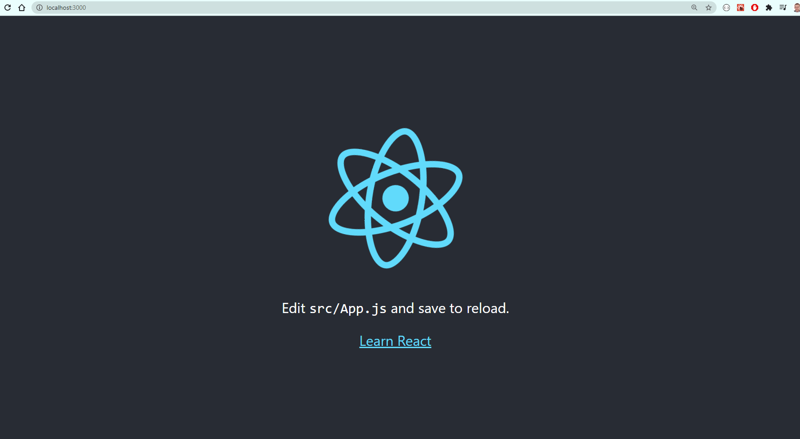

# React With Bulma 

Build 01

## Contents

- [React With Bulma](#react-with-bulma)
  - [Contents](#contents)
  - [Introduction](#introduction)
- [Getting Started with Create React App](#getting-started-with-create-react-app)
  - [Available Scripts](#available-scripts)
    - [`yarn start`](#yarn-start)
    - [`yarn test`](#yarn-test)
    - [`yarn build`](#yarn-build)
    - [`yarn eject`](#yarn-eject)
  - [Learn More](#learn-more)
    - [Code Splitting](#code-splitting)
    - [Analyzing the Bundle Size](#analyzing-the-bundle-size)
    - [Making a Progressive Web App](#making-a-progressive-web-app)
    - [Advanced Configuration](#advanced-configuration)
    - [Deployment](#deployment)
    - [`yarn build` fails to minify](#yarn-build-fails-to-minify)


## Introduction

Simple walkthrough to build a react app template and add Bulma CSS

```js
choco install yarn
yarn global add create-react-app
create-react-app react-with-bulma-css-01
cd react-with-bulma-css-01
yarn start
```

<p align="center"></p>

```js
yarn add bulma bulmaswatch node-sass
```

Rename `index.css` and its reference in `index.js`

```js
import './index.scss';
```

Replace `index.scss`

```css
@import "node_modules/bulmaswatch/cerulean/bulmaswatch";
```

Replace `app.js` with content from https://bulma.io/documentation/overview/start/#starter-template

```js
import './App.css';
import React from 'react'

class App extends React.Component {
  render() {
    return (
      <section className="section">
        <div className="container">
          <h1 className="title">Hello World</h1>
          <p className="subtitle">
            My first website with <strong>Bulma</strong>!
          </p>
        </div>
      </section>
    );
  }
}
export default App;
```


