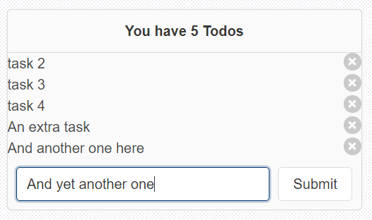

# To Do List

## Contents

- [To Do List](#to-do-list)
  - [Contents](#contents)
  - [Introduction](#introduction)
  - [Getting started](#getting-started)
  - [Tests](#tests)
  - [To Do List version 2](#to-do-list-version-2)
  - [Set state](#set-state)

## Introduction

Using basic React with Bulma CSS to build a ToDo application not using any back end, but just using React for the basics.

Following this tutorial at https://medium.com/javascript-in-plain-english/build-a-simple-todo-app-with-react-561579b39ad1 to build this app https://codepen.io/wilstaley/pen/KKwypJW 

## Getting started

```js
create-react-app to-do-list-01
cd to-do-list-01
yarn add bulma bulmaswatch node-sass
yarn start
```

Rename `index.css` and its reference in `index.js`

```js
import './index.scss';
```

Replace `index.scss`

```css
@import "node_modules/bulmaswatch/cerulean/bulmaswatch";
```

Replace `app.js` with content from https://bulma.io/documentation/overview/start/#starter-template

```js
import './App.css';
import React from 'react'

class App extends React.Component {
  render() {
    return (
      <section className="section">
        <div className="container">
          <h1 className="title">Hello World</h1>
          <p className="subtitle">
            My first website with <strong>Bulma</strong>!
          </p>
        </div>
      </section>
    );
  }
}
export default App;
```

We can now apply the CSS from the tutorial into `src\index.scss`

```css
@import "node_modules/bulmaswatch/cerulean/bulmaswatch";

form {
  display: flex;
  padding: 10px;
}
.wrapper {
  min-height: 100vh;
  display: flex;
  justify-content: center;
  align-items: center;
  background-image: url('data:image/svg+xml,%3Csvg xmlns="http://www.w3.org/2000/svg" width="4" height="4" viewBox="0 0 4 4"%3E%3Cpath fill="%239C92AC" fill-opacity="0.4" d="M1 3h1v1H1V3zm2-2h1v1H3V1z"%3E%3C/path%3E%3C/svg%3E');
}
.input {
  margin-right: 10px;
}
.frame {
  width: 40vw;
  max-width: 400px;
}
.header {
  display: inline;
  text-align: center;
}
.list-wrapper {
  max-height: 200px;
  overflow-y: auto;
}
```

Add `state` to `App.js` above `render()`

```js
state = { tasks: [ 'task 1', 'task 2', 'task 3'] };
```

Also in `App.js` change the text to use some Bulma classes of `card` and `frame`

```jsx
import './App.css';
import React from 'react'

class App extends React.Component {

  state = { tasks: [ 'task 1', 'task 2', 'task 3'] };

  render() {
    return (
      <div className="wrapper">
        <div className="card frame">
          <h1 className="title">React App Component</h1>
          <p className="subtitle">
            My first website with <strong>Bulma</strong>!
          </p>
        </div>
      </div>
    );
  }
}
export default App;
```

Next in `App.js` add a `Header` component

```jsx
const Header = (props) => {
  return(
    <div className='card-header'>
      <h1 className='card-header-title header'>
        You have {props.numTodos} Todos
      </h1>
    </div>
  );
}
```

and reference it inside the main content of `App.js`

```jsx
import './App.css';
import React from 'react'

class App extends React.Component {

  state = { tasks: [ 'task 1', 'task 2', 'task 3'] };

  render() {
    return (
      <div className="wrapper">
        <div className="card frame">
          <Header />
        </div>
      </div>
    );
  }
}

const Header = (props) => {
  return(
    <div className='card-header'>
      <h1 className='card-header-title header'>
        You have {props.numTodos} Todos
      </h1>
    </div>
  );
}

export default App;
/*
You have Todos
*/
```

The app now shows some Todos but not passing any props through

So let's pass some `props` through

```jsx
<Header numTodos={this.state.tasks.length} />
/*
You have 3 Todos
*/
```

So we are now passing data into the component and if we add another item into the array the length will also update

That's the header component done.

Let's now add in the `TodoList` component which maps each todo item in the tasks array and returns an HTML element which is displayed 

```jsx
const TodoList = (props) => {
  const todos = props.tasks.map( (todo, index) => {
      return <Todo content={todo} key={index} id={index} />
    }
  );
  return (
    <div className='list-wrapper'>
      {todos}
    </div>
  );
}
```

And the `Todo` component which will 

```jsx
const Todo = (props) => {
  return (
    <div className = 'list-item'>
      {props.content}
      <button class="delete is-pulled-right"></button>
    </div>
  );
}
```

and finally display our todo list

```jsx
<TodoList tasks={this.state.tasks} />
```

```jsx
import './App.css';
import React from 'react'

class App extends React.Component {

  state = { tasks: [ 'task 1', 'task 2', 'task 3', 'task 4'] };

  render() {
    return (
      <div className="wrapper">
        <div className="card frame">
        <Header numTodos={this.state.tasks.length} />
        <TodoList tasks={this.state.tasks} />
        </div>
      </div>
    );
  }
}

const Header = (props) => {
  return(
    <div className='card-header'>
      <h1 className='card-header-title header'>
        You have {props.numTodos} Todos
      </h1>
    </div>
  );
}

const TodoList = (props) => {
  const todos = props.tasks.map( (todo, index) => {
      return <Todo content={todo} key={index} id={index} />
    }
  );
  return (
    <div className='list-wrapper'>
      {todos}
    </div>
  );
}

const Todo = (props) => {
  return (
    <div className = 'list-item'>
      {props.content}
      <button class="delete is-pulled-right"></button>
    </div>
  );
}

export default App;
```

To delete an item we add in this function

```jsx
handleDelete = (index) => {
  const newArray = [...this.state.tasks];
  newArray.splice(index,1)
  this.setState({tasks:newArray});
}
```

```jsx
<TodoList tasks={this.state.tasks} onDelete={this.handleDelete} />
```

Then add `onDelete` as a prop

```jsx
const TodoList = (props) => {
  const todos = props.tasks.map( (todo, index) => {
      return <Todo content={todo} key={index} id={index} onDelete={props.onDelete} />
    }
  );
  return (
    <div className='list-wrapper'>
      {todos}
    </div>
  );
}
```

and finally the event handler to trigger onDelete

```jsx
const Todo = (props) => {
  return (
    <div className = 'list-item'>
      {props.content}
      <button class="delete is-pulled-right" onClick={ () => {
        props.onDelete(props.id)
      }}>
      </button>
    </div>
  );
}
```

Now our app should delete items from the array

```jsx
const Todo = (props) => {
  return (
    <div className = 'list-item'>
      {props.content}
      <button class="delete is-pulled-right" onClick={ () => {
        props.onDelete(props.id)
      }}>
      </button>
    </div>
  );
}
```

Now for the final part to add items to our array

```jsx
class SubmitForm extends React.Component {
  render(){
    return (
      <form>
        <input type='text' className='input' placeholder='Enter item' />
        <button className='button'>Submit</button>
      </form>
    );
  }
}
```

and we add the `state` of the item as well where `term` is the value in the input field

```jsx
class SubmitForm extends React.Component {
  state = { term: '' };
  render(){
    return (
      <form>
        <input type='text' className='input' placeholder='Enter item' 
          value={this.state.term}
          onChange={(e)=>this.setState({term:e.target.value})}
        />
        <button className='button'>Submit</button>
      </form>
    );
  }
}
```

we now add in our `handleSubmit` function into our `App` component

```jsx
handleSubmit = task => {
  this.setState({tasks: [...this.state.tasks,task]})
}
```

and finally add in this component

```jsx
<SubmitForm onFormSubmit={this.handleSubmit} />
```

To trigger this add in the event handler in our `Form` component

```jsx
handleSubmit = (e) => {
  e.preventDefault();
  if(this.state.term==='') return;
  this.props.onFormSubmit(this.state.term)
  this.setState({term: ''});
}
```


Final working code with add, remove and view is here

```jsx
import './App.css';
import React from 'react'

class App extends React.Component {

  state = { tasks: [ 'task 1', 'task 2', 'task 3', 'task 4'] };

  handleDelete = (index) => {
    const newArray = [...this.state.tasks];
    newArray.splice(index,1)
    this.setState({tasks:newArray});
  }

  handleSubmit = task => {
    this.setState({tasks: [...this.state.tasks,task]})
  }

  render() {
    return (
      <div className="wrapper">
        <div className="card frame">
        <Header numTodos={this.state.tasks.length} />
        <TodoList tasks={this.state.tasks} onDelete={this.handleDelete} />
        <SubmitForm onFormSubmit={this.handleSubmit} />
        </div>
      </div>
    );
  }
}

const Header = (props) => {
  return(
    <div className='card-header'>
      <h1 className='card-header-title header'>
        You have {props.numTodos} Todos
      </h1>
    </div>
  );
}


const TodoList = (props) => {
  const todos = props.tasks.map( (todo, index) => {
      return <Todo content={todo} key={index} id={index} onDelete={props.onDelete} />
    }
  );
  return (
    <div className='list-wrapper'>
      {todos}
    </div>
  );
}

const Todo = (props) => {
  return (
    <div className = 'list-item'>
      {props.content}
      <button class="delete is-pulled-right" onClick={ () => {
        props.onDelete(props.id)
      }}>
      </button>
    </div>
  );
}

class SubmitForm extends React.Component {
  state = { term: '' };

  handleSubmit = (e) => {
    e.preventDefault();
    if(this.state.term==='') return;
    this.props.onFormSubmit(this.state.term)
    this.setState({term: ''});
  }

  render(){
    return (
      <form onSubmit={this.handleSubmit}>
        <input type='text' className='input' placeholder='Enter item' 
          value={this.state.term}
          onChange={(e)=>this.setState({term:e.target.value})}
        />
        <button className='button'>Submit</button>
      </form>
    );
  }
}

export default App;
```

<p align="center"></p>

## Tests

I have added working tests also to this, which all pass, including adding an element to the ToDo list

```js
import { fireEvent, render, screen } from '@testing-library/react';
import App from './App';
import React from 'react'
import { Simulate } from 'react-dom/test-utils';

test('renders header correctly', () => {
  render(<App />);
  const linkElement = screen.getByText(/you have/i);
  expect(linkElement).toBeInTheDocument();
});

test('renders header correctly 2', () => {
  render(<App />);
  const linkElement = screen.getByText(/todos/i);
  expect(linkElement).toBeInTheDocument();
});

test('renders submit button', () => {
  render(<App />);
  const linkElement = screen.getByText(/submit/i);
  expect(linkElement).toBeInTheDocument();
});

test('add extra todo item', () => {
  render(<App />);
  const inputBox = screen.getByTestId(/inputBox/i)
  const submitButton = screen.getByTestId(/submitButton/i);
  fireEvent.change(inputBox,{target: {value:'do something'} });
  Simulate.click(submitButton);
  fireEvent(submitButton, new MouseEvent('click'))
  const todoItem = screen.getByText(/do something/i);
  expect(todoItem).toBeInTheDocument();
});
```

## To Do List version 2

OK so the first version I have created and all works well, so am very pleased with it.

Just want to work it through again and try and add some of my own touches to it, perhaps adding editing function as well.

```js
create-react-app to-do-list-02
cd to-do-list-02
yarn add bulma bulmaswatch node-sass
```

Clear out the react boilerplate code

index.js

```js
import React from 'react';
import ReactDOM from 'react-dom';
import './index.css';
import App from './App';

ReactDOM.render(
  <React.StrictMode>
    <App />
  </React.StrictMode>,
  document.getElementById('root')
);
```

App.js

```js
import logo from './logo.svg';
import './App.css';
function App() {
  return (
    <div className="App">
      <header className="AppHeader">
        <h1>To Do List</h1>
      </header>
    </div>
  );
}
export default App;
```

App.css

```css
.App{
  width:80vw;
  margin:auto;
}
.AppHeader{
  margin-top:5vh;
}
```

## Set state

Here I am going to try and read in the initial state of the app from an API online

```js
fetch('https://jsonplaceholder.typicode.com/todos/1')
  .then(response => response.json())
  .then(json => console.log(json))
```

OK so here is `App.js` reading in data

```jsx
import './App.css';
function App() {
  console.clear();
  const state = { 
    title: "state",
    tasks: [] 
  }
  fetch('https://jsonplaceholder.typicode.com/todos')
    .then(response => response.json())
    .then(json => {
      for (let i=0; i<3; i++){
        state.tasks.push(json[i])
      }
      console.log(state)
    });
  return (
    <div className="App">
      <header className="AppHeader">
        <h1>To Do List</h1>
      </header>
    </div>
  );
}
export default App;
/*
{
  tasks:[
    0: {userId: 1, id: 1, title: "delectus aut autem", completed: false}
    1: {userId: 1, id: 2, title: "quis ut nam facilis et officia qui", completed: false}
    2: {userId: 1, id: 3, title: "fugiat veniam minus", completed: false}
  ],
  title: "state"
}
*/
```

We can display our todos directly on the screen

```jsx
import './App.css';
import ReactDOM from 'react-dom'
function App() {
  console.clear();
  const state = { 
    title: "Here are some items to complete",
    tasks: ['This is a task','and this is another task'] ,
  }
  return (
    <div className="App">
      <header className="AppHeader">
        <h1>To Do List</h1>
        <strong>{state.title}</strong>
        <br />
        <ul>
        {state.tasks.map(task=>(
          <>
            <li>{task}</li>
          </>
        ))}
        </ul>
      </header>
    </div>
  );
}
export default App;
/*
To Do List
Here are some items to complete
- This is a task
- and this is another task
*/
```

We can also call the display as a function

```jsx
import './App.css';
import ReactDOM from 'react-dom'
function App() {
  console.clear();
  const state = { 
    title: "Here are some items to complete",
    tasks: ['This is a task','and this is another task'] ,
  }
  
  function displayToDos(){
      return(
        <ul>
          {state.tasks.map(todo=>(
            <li>{todo}</li>
          ))}
        </ul>
      );
  }
  return (
    <div className="App">
      <header className="AppHeader">
        <h1>To Do List</h1>
        <strong>{state.title}</strong>
        <br />
        {displayToDos()}
      </header>
    </div>
  );
}
export default App;
```

Finally we can display them as a component

